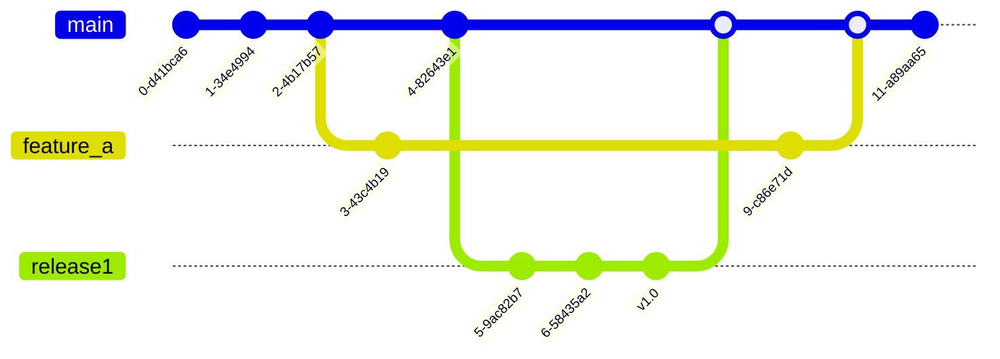

# Git のワークフロー

Git は人気なバージョン管理するツールです。色々な人は Git の使い方を良く知っていますが、Git を仕事やワークフローに統合する方法を余り良く知らない人もいます。この記事は Git をワークフローに統合する 9 方法を説明します。

1. [Centralized Workflow](#centralized-workflow)
1. [Feature branching/GitHub Flow](#feature-branching--github-flow)
1. [Trunk Based Flow](#trunk-based-development)
1. [Git Feature Flow](#git-feature-flow)
1. [Git Flow](#git-flow)
1. [Enhanced Git Flow](#enhanced-git-flow)
1. [One Flow](#one-flow)
1. [GitLab Flow](#gitlab-flow)
1. [Forking Workflow](#forking-workflow)

分かりやすくするために、同じコンセプトを説明するに一つ以上の図を使った場合があります。

---

## Centralized Workflow

**説明：**

集中化ワークフローではプロジェクトにおけるすべての変更の単一の入力箇所として中央リポジトリを使用します。デフォルトの開発用ブランチは main と呼ばれ、すべての変更がこのブランチにコミットされます。
集中化ワークフローでは main 以外のブランチは不要です。チームメンバー全員がひとつのブランチで作業し、変更を直接中央リポジトリにプッシュします。

**メリット：**

1. SVN のような集中型バージョン管理システムから移行する小規模チームに最適。

**デメリット：**

1. お互いのコードが邪魔になり (お互いの変更を上書きするように)、プロダクション環境にバグをい入れる可能性が高くて、複数のメンバいるチームでこのフローを使いにくい。
    

**地図：**
 

---

## Feature branching / GitHub Flow

**説明：**

すべての機能開発を main ブランチではなく専用のブランチで行う。main ブランチに壊れたコードは含まれない、いつもリリース出来るコードを含む。（master ブランチにあるものはすべてデプロイ可能だ）
開発者はメインブランチからフィーチャーブランチを作成し、変更が完了したらプルリクエストを使ってメインブランチにマージする。
`merge`の後にフィーチャーブランチを消す。
開発者は絶対に直接に`main`ブランチにプッシュしない、いつも`pull request`する。

**メリット：**

1. すぐに理解することが出来る (一番分かりやすいワークフロー)
1. main のコードベースに影響を与えることなく複数の開発者が別々のフィーチャー開発作業を行える
1. CI/CD の為に適す
1. プルリクエストの活用でブランチに関連した問題点を議論出来る
1. よくリリースするプロジェクトに使える/に適す
1. ウェブサイト開発のプロジェクトにように一つだけのバージョンが要るプロジェクトに適す
1. merge conflict が少ない

**デメリット：**

1. 主なブランチが`main`しかないので、 異なるタスクを互いに分けて管理するのは少し難しくて、チームにとっては混乱した状況になる恐れがある
1. リリースと開発ような環境専用のブランチがない、本番環境でバグが発生しやすく
1. 同時に複数のバージョンをサポートする事が必要なら、このワークフローを使えない
1. 複数の`feature branch`の完了が（同時に）長く時間かかったら行ったら、`merge`するのは難しくなる
    

**地図：**
 

地図 1

source: [https://www.atlassian.com/git/tutorials/comparing-workflows/feature-branch-workflow](https://www.atlassian.com/git/tutorials/comparing-workflows/feature-branch-workflow)
 

地図 2

source: [https://www.optimizely.com/optimization-glossary/trunk-based-development/](https://www.optimizely.com/optimization-glossary/trunk-based-development/)
 

地図 3

source: <https://www.gitkraken.com/learn/git/best-practices/git-branch-strategy>

---

## Trunk Based Development

**説明：**

エンジニアは、小さな変更をより頻繁にメインのコードベースにマージし、長期間のフィーチャーブランチで作業するよりも、トランク(`main`ブランチ)のコピーで作業する。多くの場合、`feature`ブランチには特徴の一部しか含まれないため、`feature`ブランチは小さくなる。
`feature`ブランチを`main`ブランチに`merge`する前に`feature`ブランチをよくテストする。

GitHub Flow と似ている、二つの違いさがある

1. `feature branch`が完了するまで待たず、`main`ブランチに`merge`する
1. 小さいなチームの場合は小さなコード変更なら開発者は直接に`main`ブランチにプッシュ出来る

**メリット：**

1. `merge conflict`が一番少ないワークフロー
1. かりやすいワークフロー
1. CI/CD の為に適す
1. プルリクエストの活用でブランチに関連した問題点を議論出来る
1. よくリリースするプロジェクトに使える/に適す
1. ウェブサイト開発のプロジェクトにように一つだけのバージョンが要るプロジェクトに適す

**デメリット：**

1. フィーチャーが完了ず`main`に`merge`するので、`main`ブランチにバグを入れ恐れがある
1. フィーチャーが完了ず`main`に`merge`する為に、よく`Feature Toggle/Flag`を使られるけど、その為に経験を持っている開発者が必要
1. 主なブランチが`main`しかないので、 異なるタスクを互いに分けて管理するのは少し難しくて、チームにとっては混乱した状況になる恐れがある
1. リリースと開発ような環境専用のブランチがない、本番環境でバグが発生しやすく
1. 同時に複数のバージョンをサポートする事が必要なら、このワークフローを使えない
    

**地図：**
 

source: [https://www.optimizely.com/optimization-glossary/trunk-based-development/](https://www.optimizely.com/optimization-glossary/trunk-based-development/)

---

## Git Flow

**説明：**

`main`と`develop`と言う 2 つの長期ブランチとさらに`feature`、`release`、`hotfix` といった追加のブランチを特定の目的に使用する。ブランチの役割分担を明確にし、いつ、どのように相互作用するかを定義している。機能ブランチに加え、リリースの準備、メンテナンス、記録にも個々のブランチを使用する。

プロダクション環境のコードが`main`ブランチで保存される

**メリット：**

1. 特別の`release`ブランチがあるので構造化されたリリースサイクルを持つプロジェクトに最適
1. デプロイ前に機能の広範なテストを必要な場合に適す。
1. プロジェクトをよく構造する (さまざまな種類のブランチがあるため、直感的に仕事を整理しやすい。)
1. 同時にアプリケーションの複数のバージョンをサポート出来る

**デメリット：**

1. プロジェクトによって開発プロセスやリリースサイクルを複雑にしすぎ、遅らせる恐れがある。
1. (プロジェクトによって) CI/CD が難しい。
1. 主なブランチが`main`じゃなくて、`develop`で、慣れるのが時間掛かる
1. よく同じコードを二つのブランチに`merge`する必要があるので、`merge`を忘れ、間違いやすい(release と hot-fix ブランチの場合)
1. Git History が分かりにくくなる
1. アプリケーションが一つだけのバージョンがある場合は進めじゃない
1. ほとんどの開発者や開発チームが実際に必要としているよりも複雑なのだ
1. 複数の`feature branch`の完了が（同時に）長く時間かかったら行ったら、`merge`するのは難しくなる
    

**地図：**
 

地図 1

source: [https://www.atlassian.com/git/tutorials/comparing-workflows/gitflow-workflow](https://www.atlassian.com/git/tutorials/comparing-workflows/gitflow-workflow)
 

地図 2

source: [https://www.gitkraken.com/learn/git/git-flow](https://www.gitkraken.com/learn/git/git-flow)
 

地図 3

source: <https://nvie.com/posts/a-successful-git-branching-model/>

---

## Enhanced Git Flow

**説明：**

`Git Flow`に似ている。`develop`、`main`、と言うブランチと`feature`ブランチがある。
`develop`ブランチに蓄積されたものを放出するときは、厳密には`main`のスーパーセットだ。
開発は`develop`ブランチで行われ、`main`ブランチはデプロイブランチです。`develop`ブランチの準備ができると、main ブランチの現在の先端が v1 などのアプリのバージョンとしてラベル付けされ、`main`ブランチのポインタが`develop`ブランチを指すように変更されます。ホットフィックスがある場合はメインブランチに対して行われ、`develop`ブランチは続行されます。`develop`ブランチの準備ができると、メインブランチは v2 のタグで停止され、`develop`ブランチにマージされます（v3 になります）。
開発は`develop`ブランチでして、`リリースする時に`develop`ブランチ名を`main`に変わって、リリースバージョンを`tag`で書く。
`feature`ブランチは`develop`に`merge`する

**メリット：**

1. ブランチの種類が少ない (Git Flow より分かりやすい)
1. リリースブランチと開発ブランチは別々
1. GitHub Flow よりもっと整理され、構造化されている

**デメリット：**

1. 余り人気がないワークフロー
1. レポゾトリを運用する人は経験と技術が必要
    

**地図：**
 

source: <https://www.toptal.com/gitflow/enhanced-git-flow-explained>
 

source: <https://www.toptal.com/gitflow/enhanced-git-flow-explained>

---

## Git Feature Flow

**説明：**

`production`、`stage`、`deployment`、`feature`と言うブランチがある。
`feature`は`production`ブランチに基づう。

流れじゃなくて、以下の通りです。

**メリット：**

1. 色々の環境のブランチがある

**デメリット：**

1. 余り人気がない
1. (他のワークフローと逆から)分かりにくい
1. 不要なステップが多い(同じコードを各ブランチに`merge`する)
1. `merge conflict`が多い
    

**地図：**
 

地図 1

 

地図 2

source: <https://medium.com/dev-managers-handbook/git-feature-flow-125d28dfef1e>

---

## GitLab Flow

**説明：**

`Gitlab Flow`は 2 種類がある：`Versioned Release`と `Continuous Release`。

**Versioned Release**
三つのブランチがある:`main`、`version`と`feature`。
各リリースには、`main`ブランチをベースにしたリリースブランチを作成。`feature`ブランチを`main`ブランチに`merge`する。バグ修正は、リリースブランチにマージする前に、まずメインブランチにマージすべき。

**Continuous Release**
`main`と`production`、`feature`と言うブランチ(と`preproduction`ような環境ブランチ)がある。開発は`main`ブランチでし、リリースする時に`main`ブランチを`production`ブランチに`merge`する。（`preproduction`ブランチがあったら、`production`に`merge`前に、`preproduction`に`merge`する）
`main`、`production`と`preproduction`ブランチに直接に`merge`しず、`pull request`する。

両方の種類でも`merge`の後、`feature`ブランチを消す。

**メリット：**

1. フレキシブル
1. （Versioned Release の場合は）アプリケーションの複数のバージョンをサポート出来る
1. （ Continuous Release の場合は）アプリケーションの一つだけのバージョンもサポート出来る
1. （ Continuous Release の場合は）CI/CD は導入出来る
1. Git Flow と Enhanced Git Flow より分かりやすい
1. GitHub Flow よりもっと整理され、構造化されている

**デメリット：**

1. 一番分かりやすいワークフローじゃない (GitHub Flow が一番分かりやすい)
1. 一番整理され、構造化されているワークフローじゃない
1. Merge Conflict が起こる恐れがある
    

**Versioned Release の地図:**
 

source: <https://www.gitkraken.com/learn/git/best-practices/git-branch-strategy>
 

**Continuous Release の地図：**
 

source: <https://github.com/jadsonjs/gitlab-flow>
 

source: <https://github.com/jadsonjs/gitlab-flow>
 

source: <https://github.com/jadsonjs/gitlab-flow>
 

source: <https://github.com/jadsonjs/gitlab-flow>
 

地図 2

source: <https://github.com/jadsonjs/gitlab-flow>

---

## One Flow

**説明：**

`Git Flow`に似ているけど、違いさは`develop`ブランチがない、開発は`main`ブランチでする。
`main`ブランチに`merge`した後に`merge`したブランチを消す(`feature`とか`release`とか`hot-fix`)

**メリット：**

1. Git Flow より分かりやすい
1. GitHub Flow より組織的

**デメリット：**

1. CI/CD に余り最適じゃない
1. merge conflict がよく起こる恐れがある
    

**地図：**
 

---

## Forking Workflow

**説明：**

このワークフローを他のワークフロー一緒に使うはずです。
外部の貢献者がメインのリポジトリに直接アクセスせずに作業できるようにするものである。貢献者は、メインリポジトリに直接アクセスすることなく作業を行うことができます。開発者はメインリポジトリのフォーク（個人的なコピー）を作成し、そこに変更を加えます。そこに変更を加えます。そして、その変更をメインリポジトリに統合するためにマージリクエストを提出します。メインリポジトリに統合します。
単一のサーバーサイドリポジトリを「中央」のコードベースとして使う代わりに、すべての開発者に独自のサーバーサイドリポジトリを提供します。つまり、各開発者はひとつではなくふたつの Git リポジトリを持つことになります。プライベートなローカルリポジトリと、パブリックなサーバーサイドリポジトリです。フォークワークフローは、公開オープンソースプロジェクトでよく見られます。

このワークフローを他のワークフローと一緒に使える

**メリット：**

1. オープンソースプロジェクトに最適

**デメリット：**

1. オープンソースプロジェクトじゃない場合は、プロジェクトに不要なステップをもたらす。

---

## 結論

全ての条件を満たすワークフローがない、一番良いワークフローもないです。どのワークフローを使うのはプロジェクトによって、チームのよって、多くの場合は好みによってです。上のワークフローは決まりじゃないので、色々な会社は自分の理解、条件と好みによって色々な修正/調整し、使っています。

私の意見は GitLab Flow を使った方が良いです。利用は環境ブランチがあり、余り複雑じゃないのでです。

---

### 役に立つリンク

**Centralized Workflow (集中化ワークフロー):**

1. <https://www.atlassian.com/ja/git/tutorials/comparing-workflows>
1. <https://www.atlassian.com/git/tutorials/comparing-workflows#centralized-workflow>

**Trunk Based Flow:**

1. <https://www.optimizely.com/optimization-glossary/trunk-based-development/>
1. <https://www.optimizely.com/optimization-glossary/feature-flags/>
1. <https://www.optimizely.com/optimization-glossary/feature-toggle/>
1. <https://martinfowler.com/articles/feature-toggles.html>
1. <https://trunkbaseddevelopment.com/>
1. <https://www.atlassian.com/continuous-delivery/continuous-integration/trunk-based-development>

**Feature branching/GitHub Flow:**

1. <https://docs.github.com/en/get-started/quickstart/github-flow>
1. <https://www.atlassian.com/ja/git/tutorials/comparing-workflows/feature-branch-workflow>
1. <https://www.atlassian.com/git/tutorials/comparing-workflows/feature-branch-workflow>
1. <https://www.atlassian.com/git/tutorials/comparing-workflows/gitflow-workflow>
1. <https://scottchacon.com/2011/08/31/github-flow.html>

**Git Flow:**

1. <https://www.atlassian.com/ja/git/tutorials/comparing-workflows/gitflow-workflow>
1. <https://nvie.com/posts/a-successful-git-branching-model/>
1. <https://www.gitkraken.com/learn/git/git-flow>

**Enhanced Git Flow:**

1. <https://www.toptal.com/gitflow/enhanced-git-flow-explained>

**Git Feature Flow:**

1. <https://medium.com/dev-managers-handbook/git-feature-flow-125d28dfef1e>

**GitLab Flow:**

1. <https://github.com/jadsonjs/gitlab-flow>
1. <https://microfluidics.utoronto.ca/gitlab/help/topics/gitlab_flow.md>
1. <https://about.gitlab.com/topics/version-control/what-is-gitlab-flow/>
1. <https://about.gitlab.com/topics/version-control/what-are-gitlab-flow-best-practices/>

**One Flow:**

1. <https://www.endoflineblog.com/oneflow-a-git-branching-model-and-workflow>

**Forking Workflow:**

1. <https://www.atlassian.com/git/tutorials/comparing-workflows/forking-workflow>

**General:**

1. <https://nira.com/git-flow-vs-github-flow/>
1. <https://www.gitkraken.com/learn/git/best-practices/git-branch-strategy>
1. <https://medium.com/@patrickporto/4-branching-workflows-for-git-30d0aaee7bf>
1. <https://about.gitlab.com/topics/version-control/what-is-git-workflow/>
