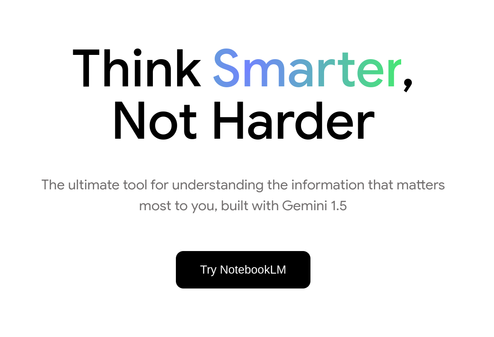
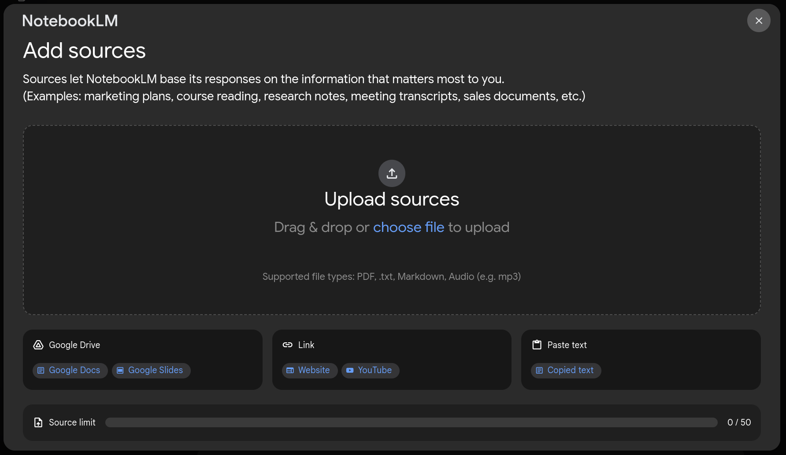
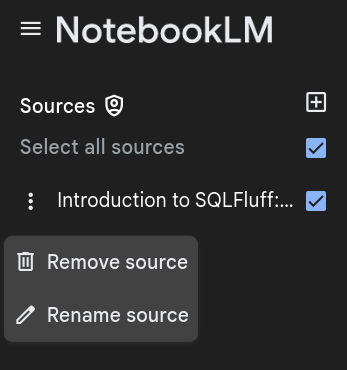
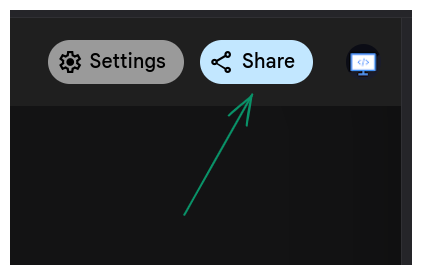
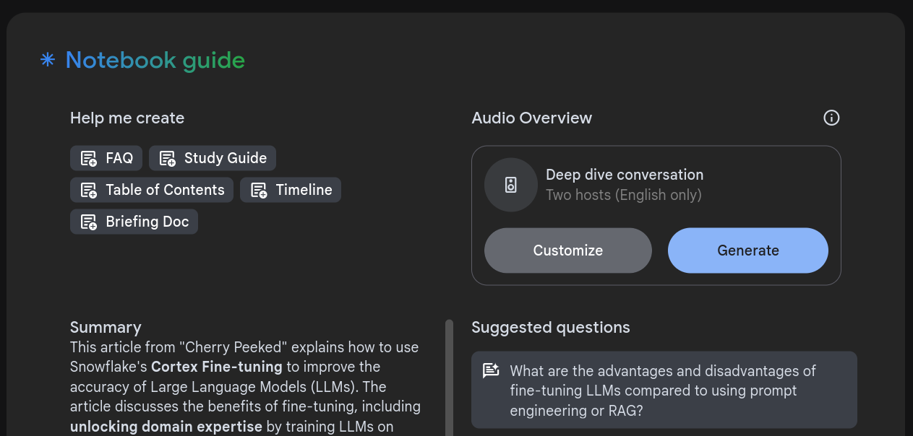
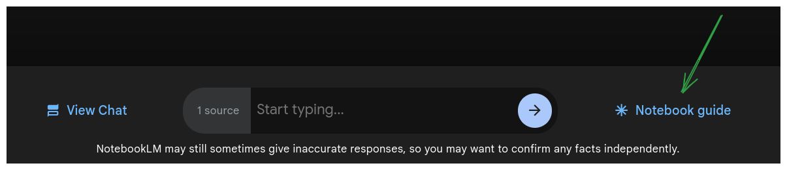
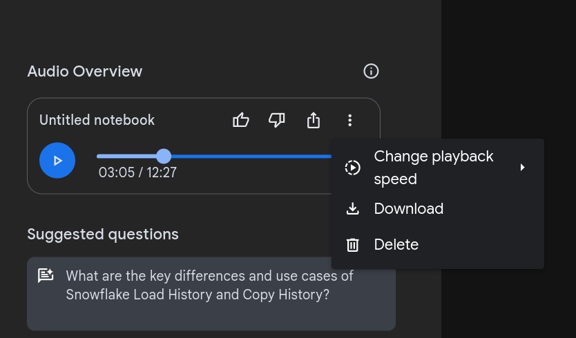

# Google NotebookLM

Considering there is a dozen or more new product released baked in AI or containing the buzzword AI, it is not surprising at all if you haven't heard of [NotebookLM](https://notebooklm.google.com/) by Google yet.
According to the homepage of NotebookLM it is "an AI-powered research and writing assistant that works best with the sources you upload". As of mid-October 2024 it is free, and experimental.
I have played with it a few times; it managed to both surprise and disappoint me.

## What is NotebookLM

 Per the homepage description  is an AI-powered research and writing assistant that works best with the sources you upload. In more descriptive words it is RAG (Retrieval Augmented Generation) enabled AI model.
 How it works is you first provide it with sources as text, pdf files and/or links to websites and then ask it questions. NotebookLM uses its general knowledge to *understand* your questions and *finds* the answer to your question solely based on the sources you provided.
 Since the generated answers include links to the exact section of the text the NotebookLM based its answer on, you can easily check the accuracy of its answers. So far, it is amazingly accurate. As for the quality of the answers, quality could've been better, but good enough for most use cases.
 In a later section I will share the example I've used.

 You can check it out using this url: [https://notebooklm.google.com/](https://notebooklm.google.com/).
 To use it you need a google account. If you have a google account it works seamlessly without prompting you to sign in.

.

When you click on the "Try NotebookLM" button, you are asked to create a notebook. You can think of a notebook as a separate isolated project.
After you create an (initially-untitled) project, a prompt appears asking you to add up to 50 sources.

As you can see on the photo, you can add the following sources:

- PDF, `.txt`, Markdown and Audio files
- Google Slides and Google Docs files in Google drive
- links to websites and YouTube videos
- Copy pasted text

You can easily select, unselect, rename and delete the sources.

You can also share the created notebook with others using the share button on the top right corner of the page.

## Pretty accurate and good quality answers

This tool is very useful when you need to find answers to your questions from multiple sources, or overly long materials, i.e it helps you find the needle in a haystack.
But it is not just a search functionality, right ? After all it has the word AI slapped in its description. So, we should be able to use it to simplify and understand complex matters too.
That's what I did! There is an article I recently wrote [an article](https://blog.hujaakbar.com/2024/10/snowflake-load-history-vs-copy-history-seven-differences.html) explaining the differences between unnecessarily confusingly named functions of Snowflake (basically there are 2 sets of functions with the same names but slightly differing functionalities).

I provided NotebookLM with the link to the article and asked it "What are the differences between Load History and Copy History functionalities of Snowflake ?".
NotebookLM could parse and *understand* text, code snippets and table information correctly. In its answer it accurately and **clearly** pointed out 6 differences out of 7 listed in the article. As for the missing difference, (one functionality is table function while others are views), the answer *included* it but NotebookLM failed to specify it clearly. The difference was *a kind of* mentioned without proper explanation, although it  is emphasized as being one of the main differences in the article. Hence, I judged the answer as being very accurate but quality-wise it could've been better. It should be mentioned that Google warns that "NotebookLM may still sometimes give inaccurate responses, so you may want to confirm any facts independently".

Important point to mention is that NotebookLM doesn't save chat history, instead it allows you to save the answers it generated.

## Surprising feature

For every Notebook, notebookLM allows users to generate an audio overview. Audio Overview is podcast-like conversation between a male and a female hosts with really nice voice. (Currently NotebookLM generates audio overviews only in English.) Besides, the generated audio overview is not merely narrated version of your sources or summary of your sources. It is more engaging and includes fillers and explanations added by AI.

**How to access Audio Overview:**

When you create a new notebook and add a source, a Notebook guide pop-up appears showing you options such as suggested question, brief summary of the NotebookLM and Audio overview section on the top right corner.

You can easily access the pop-up at any time by clicking on the "* Notebook guide" button next to input box.

Generated audio overviews can be played within the notebook itself, they can also be downloaded. In addition to that, you can make the generated audio overview public and share it with others. It will only share the audio overview not your notebook. The people you shared the link to your audio overview, can listen to the audio and download it if they please.

**Note:** You can have only one audio overview per notebook at a time, you cannot have multiple audio overviews at the same time. You cannot provide instructions either to change or modify the generated overview. What you can do is though delete the generated audio overview and generate new one. (When generating a new audio overview it is possible to give instruction via clicking on"Customize" button.)

Admittedly what I have described for far ｍay not come as a shock to people who are following latest announcements in AI landscape. But what might surprise you is the quality of the audio. With the  exception of [OpenAI's text-to-speech model](https://platform.openai.com/docs/guides/text-to-speech/overview),
I don't think there is any match to the human-like voice, intonation, and feel of the NotebookLm generated audio overview. Even Google Cloud's own [Cloud Text to Speech](https://cloud.google.com/text-to-speech) offering feels robotic and unnatural. *Probably NotebookLM is using different model.*

For test out this feature I used another article of mine, [Useful Tools For Software Development](https://blog.hujaakbar.com/2024/10/useful-tools-for-software-development.html). You can listen to the generated audio overview vis this [link](https://notebooklm.google.com/notebook/55670853-1f0f-4946-b9b9-3903234733b5/audio).

It is astonishing, isn't it (at least it was for me). Overview includes useful background explanation about CI/CD that was not in the original article and a talk about slack incident to make the conversation more engaging. If you are careful listener, however, you might have noticed two glitches. First (minor) one is in the beginning at 00:06 the woman says the word "totally" in an unnatural, weird way, the second one is at 03:42 the sentence starts with female voice then changes to male voice after the "Speak of the messes" phrase. As for the accuracy, yes overview is accurate but it does not emphasize each tool or section as it was in the article making it difficult to follow.

After my initial interaction with this audio overview feature, I wanted to test it more. I generated several audio overviews of differing sources. I also used above-mentioned article that explains differences between Load History and Copy History functionalities of Snowflake. At my disappointment, generated [audio overviews](https://notebooklm.google.com/notebook/2d57cb83-fa12-4718-9849-833ba11df31e/audio) was not good, accuracy was mid-to-low range and it included wrong filler-explanations.

## Conclusion

NotebookLM seems very useful, *except for its audio overview feature*, it is very accurate and generates overall high quality answers. Considering it is still in experimental stage, once it becomes stable one can only imagine its accuracy and quality of the answers will become even higher. Even at current stage it can do its job very well. As for audio overview feature, to put it simply it is not ready yet.

[backup download link for generated audio]:(https://stackoverflow.com/questions/69335183/snowflake-load-history/79084465#79084465)
