# Notebook の中で Streamlit を使う方法


*Image by [Jan](https://pixabay.com/users/janjf93-3084263/) from [Pixabay](https://pixabay.com//)*

データ分析において、結果を分かりやすく可視化し、共有することは非常に重要です。従来のBIツールに加えて、近年ではインタラクティブなデータアプリが注目されています。

Snowflake で Notebook と Streamlit を使えるのを知っていますか？ Notebook の中で Streamlit を使えるのも知っていますか？
SnowflakeノートブックとStreamlitを使えば、Pythonの知識だけで、簡単にインタラクティブなデータアプリを作成できます。Snowflakeノートブックは、コード、Markdownによる説明、そして可視化結果を1つのドキュメントにまとめることができるため、データ分析の作業効率を向上させます。
この記事では、Snowflakeノートブック上でStreamlitを使ってインタラクティブなデータアプリを作成する方法を紹介します。SQLクエリからデータを取得し、Streamlitのコンポーネントを使って動的なグラフや入力フォームを備えたアプリを構築する手順を、実際のコード例とともに解説します。

## Notebook と Streamlit は何でしょう？

Notebook
: ノートブックは、コードとその出力を 1 つのドキュメントに統合し、コード、説明文、視覚化、その他のリッチ メディアを組み合わせることができます。つまり、1 つのドキュメントで、コードを実行し、説明を追加し、出力を表示し、作業をより透明化することができます。
人気なのノートブックは[Jupyter Labs](https://jupyter.org/) と [Google Colab](https://colab.research.google.com/)です。

Snowflake もノートブックをサポートしています n ので、Snowflake のノートブックでは`Markdown`, `Python`と`SQL`コードを書けます。

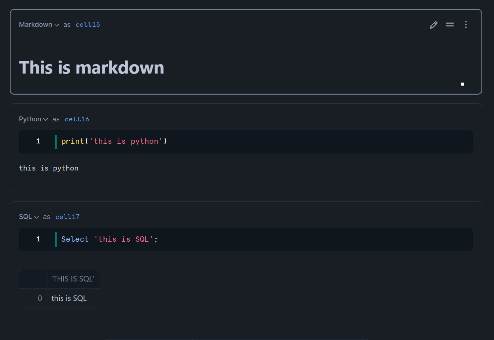

内部ノートブックは `.ipynb`. Interactive Python Notebook (インタラクティブ Python ノートブック) ファイル形式を使用します。

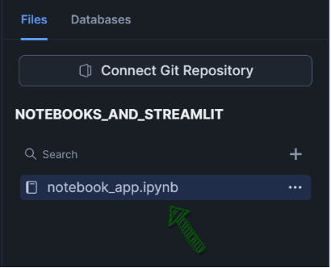

**Notebook に加えて、Snowflake が Streamlit もサポートしています。**

Streamlit
: Streamlit を利用したら、Python だけを使ってインタラクティブなウェッブアプリを開発する為に使えます。
つまり、HTML, JavaScript, CSS とかサーバサイドの言語とフレームワークの知識がなくても Streamlit を使ってウェッブアプリを開発出来ます。
[Streamlit の概要](https://streamlit.io/)

## Notebook の中で Streamlit

Notebook の中で[Streamlit](https://docs.streamlit.io/)を使う事が可能です。

**:warning: 注意点:**

> Notebook の中で Streamlit のコードを書き、実行するのは可能ですが、もう作成された別の場所である Streamlit のアプリを呼ぶことが出来ないです。
>
> もしもう作成された別の場所である Streamlit のアプリを Notebook の中で使いたいなら、その Streamlit アプリのコードをコピーし、Notebook に paste する必要があります。

Streamlit を使う為に、Streamlit と他の必要なライブラリを以下のように`import`する必要があります。

```python
import streamlit as st
```

Streamlit を Notebook で使って見ましょう！
以下のコードを実行してみてください。

```python
st.header('Streamlit is working!')
slider = st.slider(label='My Slider', min_value=0, max_value=10)
```

結果：

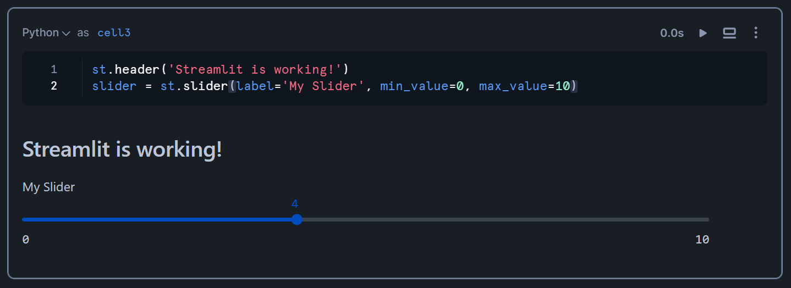

## Notebook では python セルが他のセルのデータをアクセ出来ます

他のセルのデータをアクセ出来為に、そのセルのセル名が必要です。
Snowflake が自動的に`cell1`、`cell2`ようなセル名を生成します。\
`cell#`形も、`cells.cell#`形も使えます。

もっと進め前に、デモする為に使うデータの準備をしましょう。

`dummy_sales_table`と言うテーブルを作成します。

```SQL
create or replace table dummy_sales_table
(ID integer, Region varchar, Sales integer);
```

このテーブルにデータを入力します。

```sql
insert into dummy_sales_table
values (1, 'China', 100),
 (2, 'Japan', 70),
 (3, 'US', 120),
 (4, 'France', 30),
 (5, 'Germany', 90);
```

データの確認：

```sql
select *
from dummy_sales_table;
```

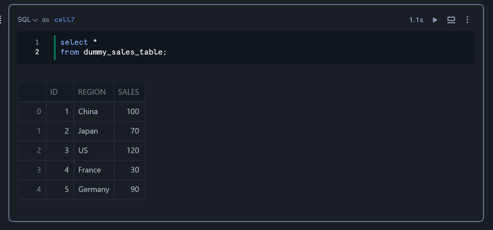

このクエリーのセル名は`cell7`です。
このセル名を利用し、python のコードを確認してみましょう。

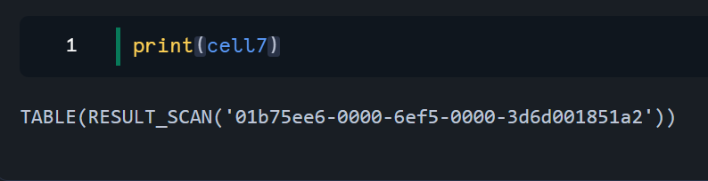

クエリーの結果を直接に使えないです。使う前に、結果をいずれか`Pandas`の`DataFrame`オブジェクトか`Snowpark`の`DataFrame`オブジェクトに変える必要があります。

じゃあ、Streamlit を利用し、上のクエリーの結果からグラフを作成しましょう。

```python
# cell7の結果を Pandas dataframeに変える
my_df = cell7.to_pandas()

# Chart the data
st.subheader("Sales in 3 key countries")
st.bar_chart(data=my_df, x='REGION', y='SALES')
```

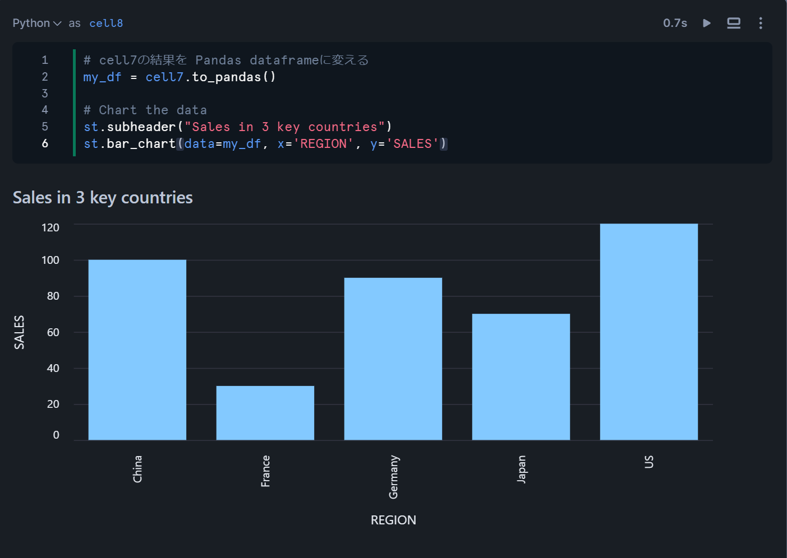

## Python セルのデータを SQL セルで使う方法

Python セルのデータを SQL セルで使う為に、variable 名を SQL セルで `{{ variable名 }}`として書いてください。

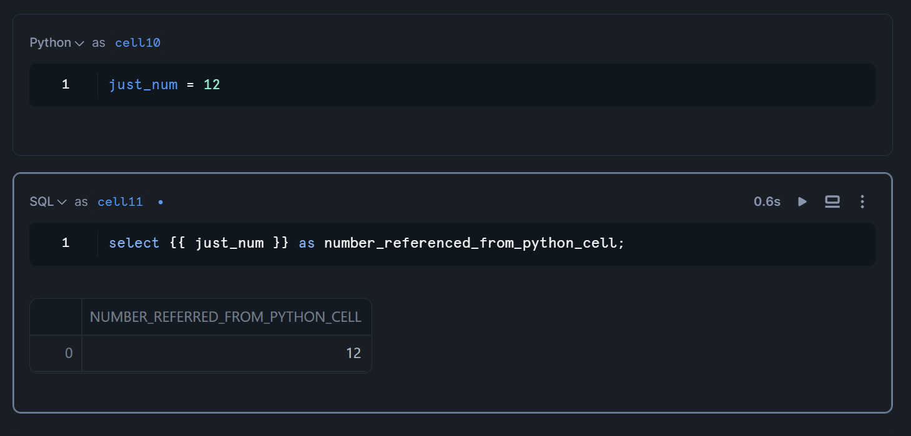

### Streamlit セルのデータを SQL セルで使う方法

Streamlit は Python ライブラリので、Streamlit セルのデータを上にように、`{{ variable名 }}`、形を使って使います。

```python
table_name = st.selectbox(
    label='見たい例名を選択してください',
    options=['dummy_sales_table', 'some_other_table']
    )

row_count = st.number_input(
    label='見たい行数を入力してください',
    value=1,
    min_value=1,
    max_value=100
    )
```

結果：

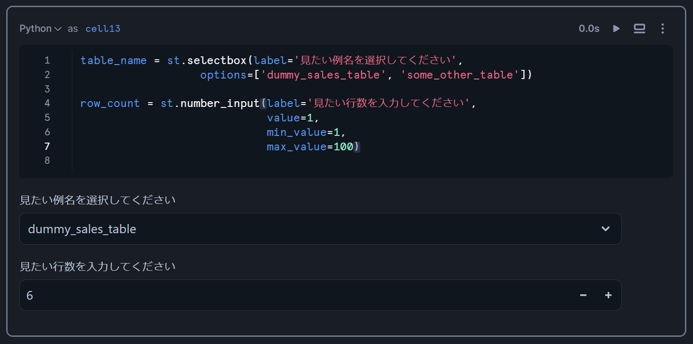

もし、セルのコードじゃなくて、セルの結果だけを見たいなら、セルの上の右側にアル 2 番目のボタンを押してください。

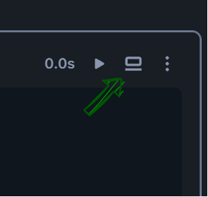

結果：

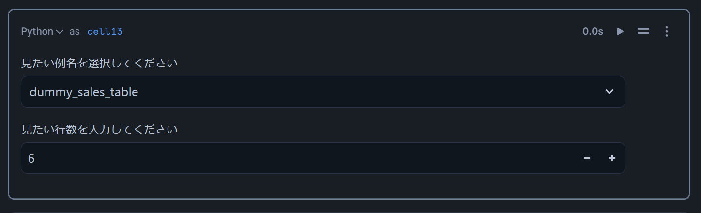

この Streamlit の`table_name`と`row_count`データを SQL クエリーで使いましょう。

```SQL
select *
from {{ table_name }}
limit {{ row_count }};
```

結果：

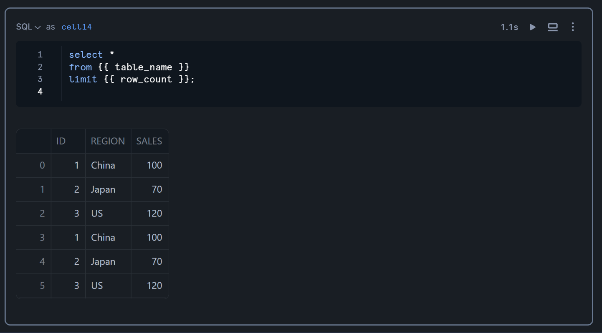

Streamlit はインテラクティブなので、Streamlit のデータの価値が変わったら、Streamlit のセルから下にアル全てのセルが自動的に再実行されります。

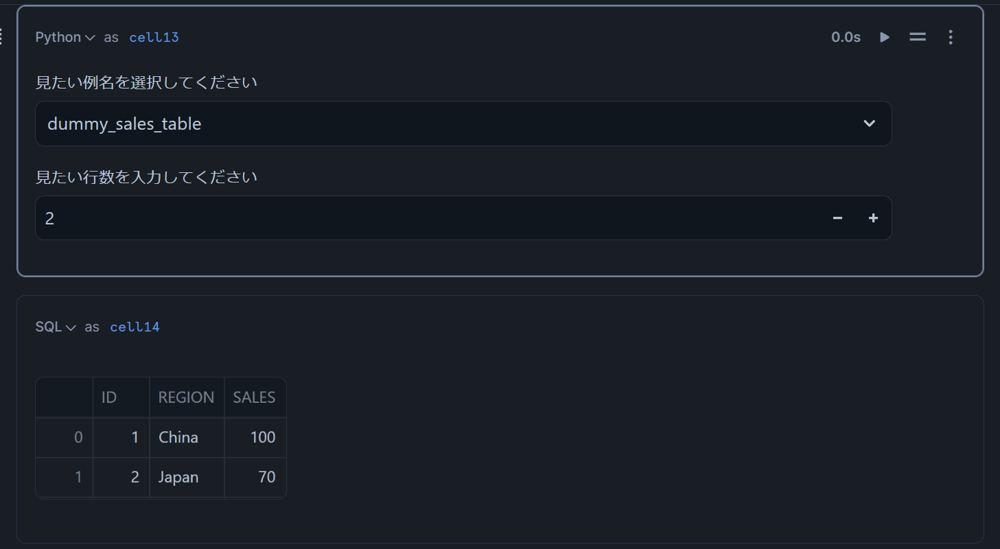

---

## 役に立つリソース

Snowflake についてもっと学びたいなら、以下の記事をご覧ください。

- [Snowflake の動的テーブル](https://blog.hujaakbar.com/2024/09/snowflake-dynamic-tables-ja.html)

- [Snowflake の Load History と Copy History の違い](https://blog.hujaakbar.com/2024/09/snowflake-load-history-vs-copy-history-ja.html)

- [Snowflake から Slack チャンネルに通知を送信する方法](https://blog.hujaakbar.com/2024/09/how-to-send-a-notification-from-snowflake-to-a-slack-channel-ja.html)

- [Snowflake Data Cloud Summit 2024 サマリー](https://blog.hujaakbar.com/2024/09/snowflake-data-cloud-summit-2024-summary-ja.html)
