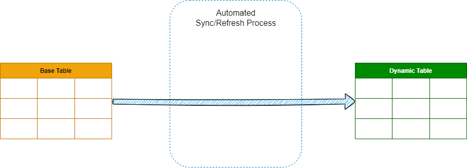

# Dynamic tables



> **TL;DR:** Dynamic tables are tables with in-built syncing capability. On the dynamic table definition you define the source tables, what data to sync and how often to sync.

Dynamic tables are used to transform data in a reliable, and automated way.
You define the source table, write sql query to select what data to sync,and set frequency to sync. Snowflake takes care of the rest. When the underlying data on which the dynamic table is based on changes, the table is updated to reflect those changes. These updates are automated and referred to as a "refresh".

Source of the dynamic table can be multiple tables and even another dynamic table.

**Main benefits of dynamic tables:**

- **Declarative programming:** You can define define the end state using declarative SQL and let Snowflake handle the pipeline management.

- **Easy switching:** Transition seamlessly from batch to streaming with a single `ALTER DYNAMIC TABLE` command. You control how often data is refreshed in your pipeline, which helps balance cost and data freshness.

**Note:** A dynamic table’s content is based on the query, and it can’t be modified using DML operations.

## How dynamic tables work

Dynamic tables rely on change tracking on base tables to notice changes, if change tracking is not already enabled on the base tables, Snowflake automatically attempts to enable change tracking on them. The user creating the dynamic table must have the `OWNERSHIP` privilege to enable change tracking on all underlying objects/tables.

> **Change tracking**
> Specifies whether to enable change tracking on the table. It enables change tracking on the table. This setting adds a pair of hidden columns to the source table and begins storing change-tracking metadata in the columns. These columns consume a small amount of storage.
>
> The change-tracking metadata can be queried using the `CHANGES` clause for `SELECT` statements, or by creating and querying one or more streams on the table.
>
> You can enable change tracking either while creating the table or using `Alter table` command:
>
> ```SQL
> CREATE OR REPLACE products
> ...
> CHANGE_TRACKING = TRUE 
> ;
> ```
>
> or
>
> ```SQL
> ALTER TABLE products SET CHANGE_TRACKING = TRUE;
> ```
>
> To check if change tracking is enabled on base tables, use `SHOW VIEWS`, `SHOW TABLES` etc,  commands on the base objects, and inspect the `change_tracking` column.

Syncing data between source table and dynamic tables operates in one of two ways:

- **Incremental refresh:** This automated process analyzes the dynamic table’s query and calculates changes since the last refresh (syncing). It then merges these changes into the table.
- **Full refresh:** When the automated process can’t perform an incremental refresh, it conducts a full refresh: completely replacing the data.

**Note:** A dynamic table’s refresh mode is determined at creation time and is immutable afterward.

 **Target lag:**
You can define either the data should be synced as soon as the source table changes (within a minute) or certain time after the source table changes. It is called 'target lag'. **Target lag** is the maximum amount of time that the dynamic table’s content should lag behind updates to the base tables.By setting target lag it is possible to optimize cost efficiency. For example, if the target lag is set to 2 hours, on the first 30 minutes 10 new rows were inserted into the base table, and after another another 30 rows were inserted. This way instead of performing syncing process twice, every time the data changes, syncing process was performed only once, within 2 hours of the first changes. Note it is different from Cron scheduling, this 2 hour lag time does not mean syncing happens every 2 hours, rather it means syncing happens within 2 hours of first changes.

Below example　sets the orders dynamic table's refresh lag to two hours:

```SQL
ALTER DYNAMIC TABLE orders SET TARGET_LAG = '2 hour';
```

***Note:***
*It is possible to set up data transformation pipeline with Streams and Tasks, but setting up Dynamic Tables is much easier compared to using Streams and Tasks*

## Creating dynamic table

```SQL
CREATE OR REPLACE DYNAMIC TABLE order
  TARGET_LAG = '30 minutes'
  WAREHOUSE = warehouse_xl
  REFRESH_MODE = INCREMENTAL
  AS
    SELECT order_id, order_source 
    FROM staging_table
    WHERE order_origin = 'America';
```

## Dynamic tables performance

Dynamic tables are intentionally designed to be simple: easy to create, use, and manage.

***Note:**
When queried, dynamic tables perform similarly to regular Snowflake tables.
The more complex the query, more time and recourse it takes*

## Access control

To have a full access (create, use, alter, monitor etc) on dynamic tables you must have either `OWNERSHIP` role or specific  privileges based on the use case:

- **to create**
  - `CREATE DYNAMIC TABLE` privilege on schema in which you plan to create the dynamic table
  - `SELECT` privilege on existing tables and views that you plan to query for the new dynamic table
  - `USAGE` privilege on database, schema and warehouse that you plan to use for the new dynamic table

- **to query**
  - `USAGE` privilege on database, schema and warehouse that contains the dynamic table
  - `SELECT` privilege on the dynamic table being queried

- **to alter**
  - `OPERATE` privilege on the dynamic table

- **to view a dynamic table’s metadata**
  - `MONITOR` privilege on the dynamic table
    *Note: `OPERATE` privilege allows Monitoring metadata, but it also allows altering dynamic table.*

> Note:
> Only a user with OWNERSHIP  privilege on the dynamic table can drop that dynamic table.

## Cost

### Compute cost

There are two compute costs associated with dynamic tables: virtual warehouses and Cloud Services compute.

- **Virtual warehouses:**
    Dynamic tables require virtual warehouses to refresh - that is, run queries against base objects when they are initialized and refreshed, including both scheduled and manual refreshes. These operations use compute resources, which consume credits.

- **Cloud Services compute:**
    Dynamic tables also require Cloud Services compute to identify changes in underlying base objects and whether the virtual warehouse needs to be invoked. If no changes are identified, virtual warehouse credits aren’t consumed since there’s no new data to refresh.

Note:
There may be instances where changes in base objects are filtered out in the dynamic table query. Even though dynamic table is not updated since the changes haven't passed the `where`/`having` clause, virtual warehouse credits are consumed because the dynamic table undergoes a refresh to determine whether the changes are applicable.

### Storage Cost

Dynamic tables require storage to store the materialized results. Similar to regular tables, you may incur additional storage cost for Time Travel, fail-safe storage, and cloning feature.

## Limitations

- A dynamic table’s content is based on the query, and it can’t be modified using DML operations.
- You can’t truncate data from a dynamic table.
- Dynamic tables can become stale if they are not refreshed within the MAX_DATA_EXTENSION_TIME_IN_DAYS period of the input tables. Once stale, dynamic tables must be recreated resume refreshes.

## Dynamic Table vs Streams and Tasks

It is possible to set up data transformation pipeline with Streams and Tasks, but setting up Dynamic Tables is much easier compared to using Streams and Tasks.

| Dynamic Table                           | Stream & Task                                  |
|--------------------------------------|---------------------------------|
| A declarative approach: You define end result you want and Snowflake takes care of its implementation | An imperative approach: You define how to transform the data step-by-step.                   |
| Dynamic syncing: syncing takes place when the data changes on the base/source table                   | You define a schedule for executing the code that transforms the data. (Scheduling the task) |
| Cannot use stored procedure and other tasks                                                           | Can use stored procedure and other tasks                                                     |
