# Free AI chatbots comparison

As of November 2024 there are many LLM powered chatbots, such as ChatGPT by OpenAI, Gemini (formerly Bard) by Google, Claude (family of LLMs) by Anthropic  and more. Majority of these chatbots have paid and free tiers. Although there are many review and comparisons of these chatbots, they mainly focus on the premium (paid) version of these chatbots. However, not everyone is willing to shell out $20 per month. I, being broke, have been using free version of chatbots since they came out. Based on my actual use, not the benchmark results, I decided to write a comparison review of free tier of AI chatbots.

I do also know that rI can't just say "based on my experience XY chatbot is the best, end of story". I need to show some material so that you as a reader can confirm the results. On later section of the post, I will discuss the prompts I used in detail. Little heads-up, I tried to use prompts that have less to do with factual accuracy. I have never seen or heard of an large language model that does not hallucinate. So you cannot always rely on the accuracy of the answers these chatbots generate. If a factually correct answer is needed, the best way to obtain it is by googling it, not via Chatbots. Having said that, AI chatbots are far from useless, they are very useful in idea generation, brainstorming and learning new concepts.

In this post, I will review free tiers of the following AI chatbots:

- ChatGPT
- Gemini 1.5 Flash
- Claude 3 Haiku & Claude 3.5 Sonnet
- Phind AI 70B & Phind Instant
- Microsoft Copilot
- Perplexity AI
- Meta-Llama-3.1-70B
- Llama-3.2-11B-Vision
- Hermes-3-Llama-3.1-8B
- CohereForAI
- Qwen2.5-72B
- Mistral-Nemo-Instruct-2407
- Microsoft/Phi-3.5-mini

Before starting I wanna clarify a few points:

1. I am not good at writing prompts. I assume I represent an average user.
1. To illustrate the difference between chatbots, I asked them to explain two concepts relating to version control systems. If you don't know what version control systems are, that's perfect! It means you can evaluate these chatbot answers more objectively.
1. The answers AI chatbots given is copy-pasted as text on this post without any modification. I found it is much better than copy-pasting screenshot which is hard to read.

To make the reading of this post more bearable and relatable, imagine you are told to make a report on Centralized Version Control Systems and Branching. You have no idea what these terms mean. Not knowing where to start, you turned to AI chatbots for help. Let's see which chatbot can help you the most to understand these concepts.

## Concept 1: Centralized Version Control Systems

As a first part of the review, I asked every chatbot the question: "What are centralized version control systems?". Oftentimes some chatbots' answers lacked details. To give a second chance to chatbots, I followed up by "Explain how centralized version control system works. Explain the workflow in detail" prompt.

### ChatGPT-4o

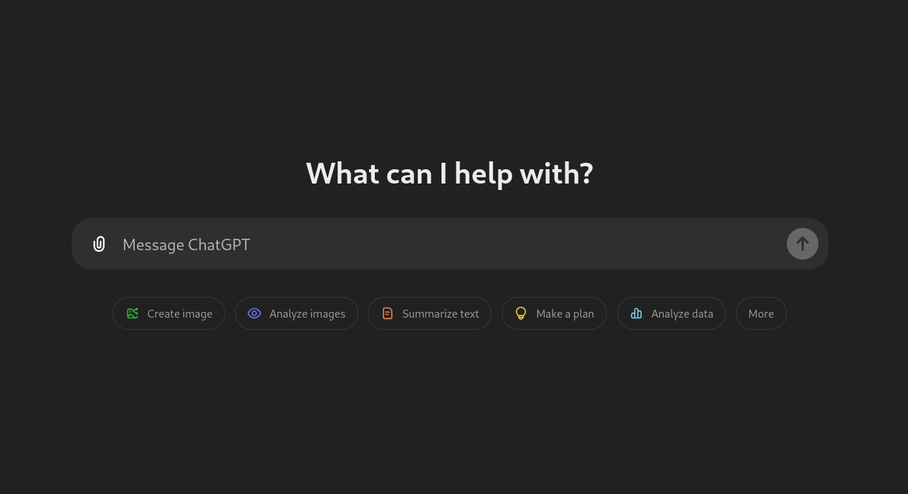

Definitely the most popular AI chatbot is ChatGPT by OpenAI. Paid version costs 20 dollars per month. Fortunately, there is a free version available. Also, now it is possible use ChatGPT without signing in and it can generate images.

Link: [https://chatgpt.com/](https://chatgpt.com/)

**Note:** Currently the free version of ChatGPT-4o model is not capable of searching the internet, at least without plugins. On October 31st 2024 OpenAI announced ChatGPT Search, a capabililty that enables ChatGPT access the internet. Although it is said that it will eventually come to free tier too, as of writing this article it is behind the paywall.

**Prompt 1:** What are centralized version control systems?

<details>
<summary>
ChatGPT's answer
</summary>
<br>
<blockquote>

Centralized Version Control Systems (CVCS) are systems in which a single, central server stores all versions of files, and developers or team members work by connecting to this server to check out and check in files. CVCS were commonly used in the past and provided a straightforward way to manage version history and ensure team members had access to the same repository of files. They include well-known tools such as *CVS* (Concurrent Versions System) and *Subversion (SVN)*.

Here's how centralized version control typically works:

1. **Central Repository**: There is a central server that holds the official, complete repository of all versions and files. Everyone in the team has to connect to this server to get the latest changes or contribute their updates.

2. **Client-Server Architecture**: Users act as clients who interact with the server. They must be connected to the server to perform most operations like committing code changes, updating to the latest version, and viewing history.

3. **Version Tracking**: The system keeps track of changes by allowing users to “commit” versions of files. This versioning ensures there is a history of changes, and if something goes wrong, it's possible to roll back to a previous state.

4. **Locking**: In some CVCS, files can be locked by one user to prevent others from making concurrent changes, which can reduce the chance of merge conflicts. However, this can also lead to bottlenecks if many developers need to work on the same file.

### Key Features of CVCS

1. **Simplicity**: In a CVCS, all users connect to a single repository, making it easier to manage permissions, backups, and overall maintenance.
2. **Reduced Complexity**: There is a single source of truth (the central server), so it’s clear which version of a file is the most current.
3. **Centralized Management**: Administrators can control access, enforce rules, and manage backups centrally, ensuring stability and security.

### Drawbacks of Centralized Version Control Systems

1. **Single Point of Failure**: If the central server goes down, no one can commit changes, and in some systems, even access to version history may be disrupted.
2. **Connectivity Dependency**: Users must have access to the server for most operations. This is a problem for developers who might work offline or in environments with unreliable internet.
3. **Less Flexibility for Parallel Work**: Developers working on the same file could face conflicts, and without sophisticated merging features, it can be cumbersome to manage large teams working on interconnected files.

### Example Workflow in a CVCS

Let’s imagine a scenario with Subversion (SVN):

   - A developer checks out the latest codebase from the SVN server. This action downloads the code locally for editing.
   - They make changes to the code on their local machine.
   - Once changes are ready, they commit their changes back to the SVN server. At this point, the central repository gets updated with these new versions.
   - If multiple developers are working on the same file, they might need to update their local copies frequently to avoid conflicts.

### Comparison to Distributed Version Control Systems (DVCS)

In contrast to CVCS, *Distributed Version Control Systems (DVCS)*, like Git or Mercurial, allow each user to have a full copy of the repository, enabling offline work and reducing the risk of a single point of failure. In DVCS, changes are shared between repositories rather than directly into a central server, offering more flexibility and resilience.

### Summary

Centralized Version Control Systems are simple, straightforward tools for managing code versions, especially useful for small teams or projects with a stable central server. However, for larger, collaborative, or remote teams, the limitations of centralized systems can be restrictive, leading to a preference for DVCS like Git in many modern development environments.
</blockquote>
</details>

**Follow-up prompt:** Explain how centralized version control system works. Explain the workflow in detail.

<details>
<summary>
ChatGPT's answer
</summary>
<br>
<blockquote>

A centralized version control system (CVCS) is a system in which all version history, files, and configurations are stored in a central server. Users, typically developers, interact with this central repository to access or update the project files. CVCS has been widely used for years, with popular tools like Subversion (SVN) and CVS being prominent examples. Let's break down the details and workflow of how a CVCS operates.

### Key Concepts of Centralized Version Control

1. **Central Repository**: A single server acts as the central location where all versions of files are stored. This server maintains the entire history of the project.
2. **Clients**: Users, usually developers, have local copies of the files they need to work on. However, unlike distributed systems, the entire project history is not on every user's machine.
3. **Working Copy**: Each user works on a local copy of the files pulled from the server. This is known as a "working copy" rather than a clone of the entire repository.
4. **Commit and Update**: Changes made locally can be committed to the central server, updating the files in the central repository. Users can also update their local copy with the latest changes from the server.

### Workflow in a Centralized Version Control System

Here's a typical workflow to illustrate how CVCS works:

#### 1. **Checking Out the Repository**

-   The user initiates a checkout operation, pulling the latest versions of files they need to work on from the central repository. This action downloads the files to the user’s local machine, creating a working copy.
-   The user does not download the entire project history, only the latest versions of the files specified. The central server still holds the full history of every file.

#### 2. **Making Changes Locally**

-   The user works on their local copy, making changes to the files as necessary.
-   Since the central repository is a single source of truth, no one else’s changes affect the user’s working copy until the user pulls updates from the server or commits their own changes.
-   While working offline, the user may make multiple changes, but these changes only exist locally until explicitly committed.

#### 3. **Committing Changes**

-   When ready, the user commits their changes. In a CVCS, a commit operation:
    -   Sends the updated files to the central repository.
    -   The server records these changes, updating the repository’s history.
    -   This process requires an internet connection, as the central server must record each change directly.
-   During the commit, the system may ask for a description of the changes. This description is stored along with the committed files in the central repository.

#### 4. **Updating the Working Copy**

-   While the user was making changes, others may have also updated files on the server. The **update** operation fetches these latest changes from the central repository, ensuring that the user has the latest version of every file.
-   During this process, conflicts can occur if multiple users changed the same part of a file. The CVCS will identify these conflicts, requiring the user to resolve them manually by choosing which changes to keep.

#### 5. **Conflict Resolution**

-   If conflicts arise, the user will typically resolve them using a built-in tool in the CVCS.
-   Once the conflicts are resolved, the user can commit these updates back to the central repository, which will then include all the latest changes without conflicts.

#### 6. **Revision Tracking and Logs**

-   The CVCS logs every commit, tracking each change made to the files over time.
-   Users can view these logs to understand the project’s history, see who made specific changes, or roll back to previous versions if necessary.

#### Example Workflow in Subversion (SVN)

Let’s consider an example scenario using SVN, a common CVCS:

1. **Checkout**: Alice needs to work on a project file, so she uses the `svn checkout` command to get a copy of the file from the repository.
2. **Edit**: Alice makes changes to the file locally.
3. **Commit**: Once she’s satisfied, Alice uses `svn commit` to upload her changes to the central repository, along with a comment describing her update.
4. **Update**: Bob also has a working copy of the project file and wants to make sure he’s working on the latest version. He uses `svn update` to download Alice’s recent changes.
5. **Conflict**: Bob tries to commit his changes but receives a notification that there’s a conflict because Alice and he edited the same lines. Bob resolves the conflict, commits the final version, and his changes are now part of the central repository.

### Advantages of Centralized Version Control Systems

-   **Simplicity**: All changes are controlled through a single, central server, making management easier.
-   **Security**: A centralized server can enforce security policies and control user access.
-   **Backup**: As the single source of truth, the central server can be routinely backed up, making data recovery simpler.

### Drawbacks of Centralized Version Control Systems

-   **Single Point of Failure**: If the central server goes down, no one can commit or update their working copies.
-   **Requires Internet**: Users need a stable internet connection to interact with the repository.
-   **Limited Collaboration Features**: CVCS does not support branching and merging as seamlessly as distributed systems, which can make collaboration more challenging.

### Conclusion

In a CVCS, the central repository serves as the core of all project data, while each user works on a local copy of the files. The workflow revolves around the processes of checking out, updating, editing, committing, and handling conflicts.

</blockquote>
</details>

**My take:**

ChapGPT's answer is for most part very well explained and comprehensive. It explained everything in detailed and gave an useful example. However, it did assume the user had some prior knowledge on version control systems because it didn't give background information, and used the terms "commit", "merge", and "check-out" without explaining their meanings first. Only in later parts of the answer it explained these terms lightly. Besides, even though Centralized Version Control Systems are mainly about version control, collaborative work is equally important feature of them. The introduction only focused on the version control part, collaboration was not emphasized adequately. Further prompting or even prompt engineering is necessary to make ChatGPT give more explanatory, easy to understand answer.

**Rating:** 8/10

**Extra Info:**

If you are not satisfied with the answer, you can either generate the different answer by clicking on "Try Again" button at the bottom of the generated answer or use a different prompt.

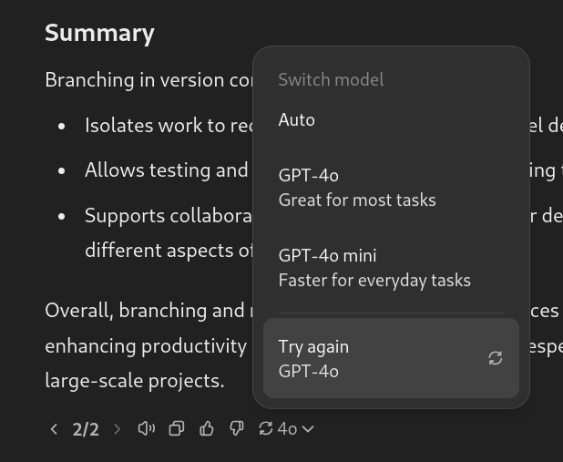

There are tailored versions of the chatbots based on GPT model accessible from ChatGPT website:

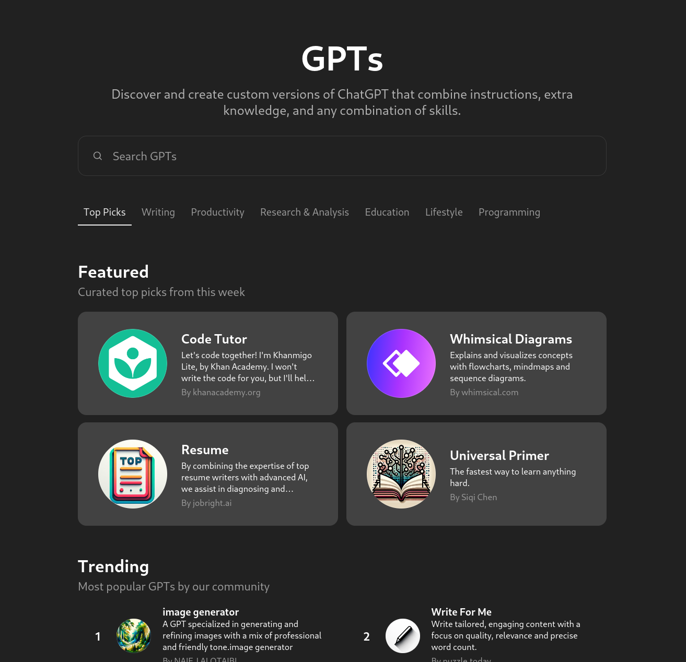

Link: [https://chatgpt.com/gpts]()

These custom GPTs seem to be the same as the original ChatGPT but with custom instructions either to use simpler terms, use examples or analogies etc.

For example Universal Primer GPT gave the following answer to "What are centralized version control systems?" prompt:

<details>
<summary>
Universal Primer's answer
</summary>
<br>
<blockquote>

Centralized Version Control Systems (CVCS) are tools that manage changes to files over time but do so in a central, single location, usually a server. In a CVCS, all the versioned files and historical records are stored on this central server, and team members connect to it to access, modify, and update files. Let’s break down this concept by thinking of it like a library with a shared logbook where everyone records their work.

### Key Concepts of Centralized Version Control

1. **The Central Repository**: Imagine a library where a single logbook keeps track of every book, every borrowing, and every return. In CVCS, this central logbook is the repository on the server, holding the "official" version of all project files and their histories. Any user who wants to work on these files must connect to this central place.

2. **Check-Out, Modify, and Check-In**: In our library analogy, when a person wants to borrow a book, they write their name and the book title in the logbook, take the book, and then return it when done. In CVCS, users "check out" files from the central server, modify them locally, and then "check in" or upload the updated files back to the server. This central repository keeps track of all changes.

3. **Version History Tracking**: Every time a user checks a file back into the repository, the CVCS records a new version of that file, much like a library would log when and how a book has been borrowed and returned. This allows users to revert to previous versions of the files if needed. The central server is, therefore, the sole place where all version history lives.

4. **Locking Mechanism**: To avoid conflicts when multiple users want to work on the same file simultaneously, many CVCS systems use "locking." Imagine if a library allowed only one person to borrow a book at a time to avoid duplicate borrowing. When a user locks a file, others can’t make changes to it until the lock is released, ensuring there’s no confusion about which version is the latest.

5. **Network Dependency**: Since all files and changes are stored on the central server, users need to be connected to the network to access or modify files. Without network access, they can’t check out or check in files. This makes a CVCS less ideal for remote or offline work compared to decentralized systems.

### Practical Example: Subversion (SVN)

One popular example of a CVCS is **Subversion (SVN)**. Here’s how it fits our analogy:

- **Centralized Storage**: All files and their histories are kept on the SVN server.
- **Check-Out and Check-In**: Users check out files, make changes locally, and check them back in to update the central version.
- **Locking**: SVN can lock files, allowing users to prevent others from making conflicting changes.

### Advantages and Disadvantages

**Advantages**:

- **Single Source of Truth**: Since there’s only one main repository, teams always know where the latest version of files is located.
- **Simpler to Manage**: The central server is easier to back up and manage since it holds everything in one place.

**Disadvantages**:

- **Network Dependency**: Users are dependent on network access to the server. If the server goes down, no one can access or modify files.
- **Limited Collaboration**: Only one person can work on a file at a time if locking is enabled, which can slow down collaborative projects.

### CVCS vs. Distributed Version Control

A Distributed Version Control System (DVCS) like Git, for instance, doesn’t rely on a single server. In a DVCS, every user has a full copy of the entire repository and version history on their local machine, allowing them to work offline and make updates without a central server.

### Summing Up

Think of CVCS like a shared, central logbook in a library, where everyone must go to the same place to borrow, modify, and return files. It’s efficient when there’s a stable network and structured workflow but can be limiting in environments that need more flexibility or offline access.

#### Checking In

Do you have familiarity with version control concepts, or would it be helpful to dive further into foundational concepts like repositories, check-in/check-out processes, or file versioning?
</blockquote>
</details>

Based on the answer one can only assume that this custom GPT is prepending instruction to my prompt: something like "answer in an easy to understand way, using analogies". It is double-edged sort, yes it makes the concept easier to understand but omits some important details.

### Gemini 1.5 Flash

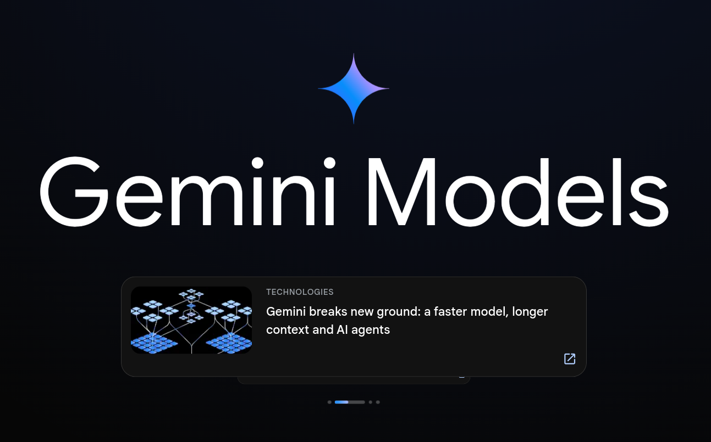

Gemini, formerly Bard, is Google's answer to OpenAi's ChatGPT. Similar to ChatGPT, Gemini also can generate images. Although not all the time, oftentimes Gemini searches the internet and bases its answers from its findings on the web. However, compared to other chatbots that can access internet, Gemini seems to use fewer webpages as its source to form its answer. Based on my experience of using both Gemini and ChatGPT, Gemini is inferior.

Link: [https://gemini.google.com/app](https://gemini.google.com/app)

**Prompt 1:** What are centralized version control systems?

<details>
    <summary>
        Gemini's default answer
    </summary>
    <br>
    <blockquote>

**Centralized Version Control Systems (CVCS)**

A Centralized Version Control System (CVCS) is a type of software that manages changes to source code over time. In a CVCS, all the version history is stored in a single, central repository. This repository is usually hosted on a server and accessible to all team members.

**How CVCS Works:**

1. **Checkout:** Developers "check out" the latest version of the code from the central repository to their local machines.
2. **Edit:** They make changes to the code locally.
3. **Commit:** Once the changes are complete, they "commit" them back to the central repository. This creates a new version of the code.

**Advantages of CVCS:**

* **Simple to learn and use:** CVCS is relatively easy to understand and implement, especially for smaller teams.
* **Centralized history:** All version history is stored in one place, making it easy to track changes and revert to previous versions.
* **File locking:** CVCS can prevent conflicts by locking files that are being edited, ensuring only one person can modify a file at a time.

**Disadvantages of CVCS:**

* **Single point of failure:** If the central server goes down, developers cannot access the code or commit changes.
* **Limited offline work:** Developers rely on the central server to work, which can be limiting in areas with unstable internet connections.
* **Scalability issues:** As teams grow larger, CVCS can become less efficient and more prone to conflicts.

**Popular CVCS Examples:**

* **Subversion (SVN):** A widely used CVCS that has been around for many years.
* **Perforce:** A powerful CVCS often used in large-scale software development projects.

While CVCS has its advantages, many modern development teams prefer Distributed Version Control Systems (DVCS) like Git, which offer more flexibility, offline capabilities, and better handling of complex workflows.

</blockquote>
</details>

**Follow-up prompt:** Explain how centralized version control system works. Explain the workflow in detail.

<details>
    <summary>
        Gemini's default answer
    </summary>
    <br>
<blockquote>

**Centralized Version Control Systems (CVCS)**

**How it Works:**

In a CVCS, all project files reside in a single, central repository. Developers interact with this repository to manage their changes.

**Workflow:**

1. **Checkout:**

    - A developer "checks out" the desired version of the project from the central repository. This creates a local copy on their machine.

2. **Edit:**

    - The developer makes changes to the local copy.

3. **Commit:**

    - Once the changes are complete, the developer "commits" them to the central repository. This records the changes and creates a new version of the project.

4. **Update:**
    - Before making further changes, the developer "updates" their local copy with the latest changes from the central repository. This ensures they're working on the most recent version and avoids conflicts.

**Key Points:**

-   **Single Source of Truth:** The central repository is the definitive version of the project.
-   **Sequential Workflow:** Developers work sequentially on the same files, preventing simultaneous editing conflicts.
-   **Centralized Control:** The administrator of the central repository has control over access and permissions.

**Advantages:**

-   **Simple:** Easy to understand and use.
-   **Centralized Control:** Provides a clear overview of the project's history and state.
-   **Suitable for Small Teams:** Works well for small teams with a simple workflow.

**Disadvantages:**

-   **Single Point of Failure:** The central repository is a single point of failure. If it becomes unavailable, development is halted.
-   **Limited Offline Work:** Developers cannot work offline for extended periods.
-   **Scalability Issues:** Can become less efficient as the team and project grow larger.

**Popular CVCS Examples:**

-   Subversion (SVN)
-   Perforce

**While CVCS has its advantages, distributed version control systems (DVCS) like Git have become more popular due to their flexibility and scalability.**

</blockquote>
</details>

**My take:** Gemini assume a lot about user's prior knowledge. It uses the terms "source code", "developers", "check-out" and others without proper explanation. Compared to ChatGPT's answer the answer lacks depths.

**Rating:** 6/10

**Extra Info:**

Gemini provides handy options to modify the answer: Gemini can easily be instructed to regenerate a simpler, longer, shorter, more casual or more professional answer. Below are the answers to the same question, "What are centralized version control systems?", in  five different modes.

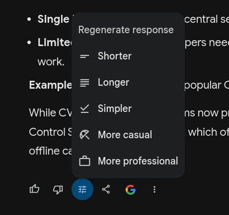

<details>
    <summary>
        Gemini's simpler answer
    </summary>
    <br>
<blockquote>
Imagine a team working on a project together. They need a way to keep track of changes and collaborate effectively. A Centralized Version Control System (CVCS) is like a central hub for their work.

**Here's how it works:**

1. **Central Repository:** There's a single, main copy of the project files stored on a server.
2. **Check Out:** Developers get a copy of the project to work on locally.
3. **Edit and Commit:** They make changes and save them back to the central repository.

**Advantages:**

* **Simple:** Easy to understand and use.
* **Centralized History:** All changes are tracked in one place.

**Disadvantages:**

* **Single Point of Failure:** If the central server goes down, work stops.
* **Limited Offline Work:** Developers need an internet connection to work.

**Example:** Subversion (SVN) is a popular CVCS.

While CVCS is useful, many teams now prefer Distributed Version Control Systems (DVCS) like Git, which offer more flexibility and offline capabilities.

</blockquote>
</details>

My take: Simpler answer lacks details and depths but it makes the concept easier to understand and emphasizes version control and collaboration.

<details>
    <summary>
        Gemini's more professional answer
    </summary>
    <br>
<blockquote>

**Centralized Version Control Systems (CVCS)**

A Centralized Version Control System (CVCS) is a software tool that manages changes to source code by maintaining a single, shared repository of files. In this model, all developers share a common repository, and all changes are committed to this central location.

**Key Characteristics of CVCS:**

* **Single Source of Truth:** A centralized repository serves as the primary source for all project files.
* **Client-Server Architecture:** Clients connect to a central server to access and modify the repository.
* **Check-Out/Check-In Model:** Developers check out files to work on locally, make changes, and then check them back in to the central repository.

**Advantages of CVCS:**

* **Simplicity:** Relatively easy to understand and use.
* **Centralized History:** All changes are tracked and accessible from a single location.
* **Access Control:** Granular permissions can be assigned to control who can access and modify the repository.

**Disadvantages of CVCS:**

* **Single Point of Failure:** The central server is a critical component, and its failure can disrupt the entire development process.
* **Limited Offline Work:** Developers require an internet connection to access and modify the repository.
* **Scalability Issues:** As projects grow larger and teams become more distributed, CVCS can become less efficient.

**Examples of CVCS:**

* Subversion (SVN)
* CVS

While CVCS has been widely used, many modern development teams have transitioned to Distributed Version Control Systems (DVCS) like Git, which offer greater flexibility, reliability, and scalability.

</blockquote>
</details>

My take: More professional answer is almost the same as the default answer.

<details>
    <summary>
        Gemini's shorter answer
    </summary>
    <br>
<blockquote>

**Centralized Version Control Systems (CVCS)**

A CVCS manages code changes using a single, shared repository. All developers work on this central repository, checking out files, making changes, and checking them back in.

**Advantages:**

* Simple to use, especially for small teams.
* Centralized history for easy review and management.
* Granular access control for security.

**Disadvantages:**

* Single point of failure: server downtime affects the entire team.
* Limited offline work: requires internet connectivity.
* Scalability issues with large teams and projects.
* Rigid workflow can be inefficient.

**Examples:**

* Subversion (SVN)
* CVS

</blockquote>
</details>

My take: the shorter answer can be called useless.

<details>
    <summary>
        Gemini's longer answer
    </summary>
    <br>
<blockquote>

**Centralized Version Control Systems (CVCS)**

A Centralized Version Control System (CVCS) is a software tool that manages changes to source code by maintaining a single, shared repository of files. In this model, all developers share a common repository, and all changes are committed to this central location.

**Key Characteristics of CVCS:**

* **Single Source of Truth:** A centralized repository serves as the primary source for all project files.
* **Client-Server Architecture:** Clients connect to a central server to access and modify the repository.
* **Check-Out/Check-In Model:** Developers check out files to work on locally, make changes, and then check them back in to the central repository.

**Advantages of CVCS:**

* **Simplicity:** Relatively easy to understand and use, especially for smaller teams and simpler projects.
* **Centralized History:** All changes are tracked and accessible from a single location, making it easier to review and manage the project's history.
* **Access Control:** Granular permissions can be assigned to control who can access and modify the repository, ensuring security and preventing unauthorized changes.

**Disadvantages of CVCS:**

* **Single Point of Failure:** The central server is a critical component, and its failure can disrupt the entire development process. If the server goes down, developers cannot access the repository or commit changes.
* **Limited Offline Work:** Developers require an internet connection to access and modify the repository. This can be a significant limitation for developers who work in areas with unreliable internet connectivity or who prefer to work offline.
* **Scalability Issues:** As projects grow larger and teams become more distributed, CVCS can become less efficient. The central server may struggle to handle a large number of concurrent users and requests, leading to performance issues and potential conflicts.
* **Lack of Flexibility:** CVCS often imposes a rigid workflow, requiring developers to check out files, make changes, and then check them back in. This can be cumbersome and inefficient for certain development practices, such as frequent small commits or parallel development.

**Examples of CVCS:**

* **Subversion (SVN):** A popular CVCS that has been widely used for many years.
* **CVS:** An older CVCS that is still used in some legacy projects.

While CVCS has been widely used, many modern development teams have transitioned to Distributed Version Control Systems (DVCS) like Git, which offer greater flexibility, reliability, and scalability. DVCS allows developers to work independently on their local copies of the repository, making it easier to collaborate, experiment, and resolve conflicts.

</blockquote>
</details>

My take: the longer answer indeed is little longer when it explains advantages and disadvantages of CVCS, but the extra words/sentences don't add any value.

<details>
    <summary>
        Gemini's more casual answer
    </summary>
    <br>
<blockquote>
Okay, here's a more casual explanation of centralized version control systems:

**Centralized Version Control (CVCS) is like a single, shared document that everyone on your team works on.**

Imagine you and your friends are working on a group project. Instead of each of you having your own copy, you all work on one big shared document.  That's kind of how CVCS works.

**Pros:**

* **Simple:** It's pretty straightforward to use, especially for smaller teams.
* **Centralized History:**  It's easy to see who changed what and when.

**Cons:**

* **Single Point of Failure:** If the main document gets lost or corrupted, everyone's work is at risk.
* **Limited Offline Work:** You need to be connected to the internet to work on the document.
* **Scalability Issues:**  It can get messy with large teams and complex projects.

**Examples:**

* **Subversion (SVN):**  One of the most popular CVCS tools.
* **CVS:**  An older, less commonly used CVCS.

</blockquote>
</details>

My take: the causal answer fails to identify CVCS as software, and answer lacks details.

Overall no matter which mode it is used, Gemini's answer was at most 6 out of 8.

### Claude

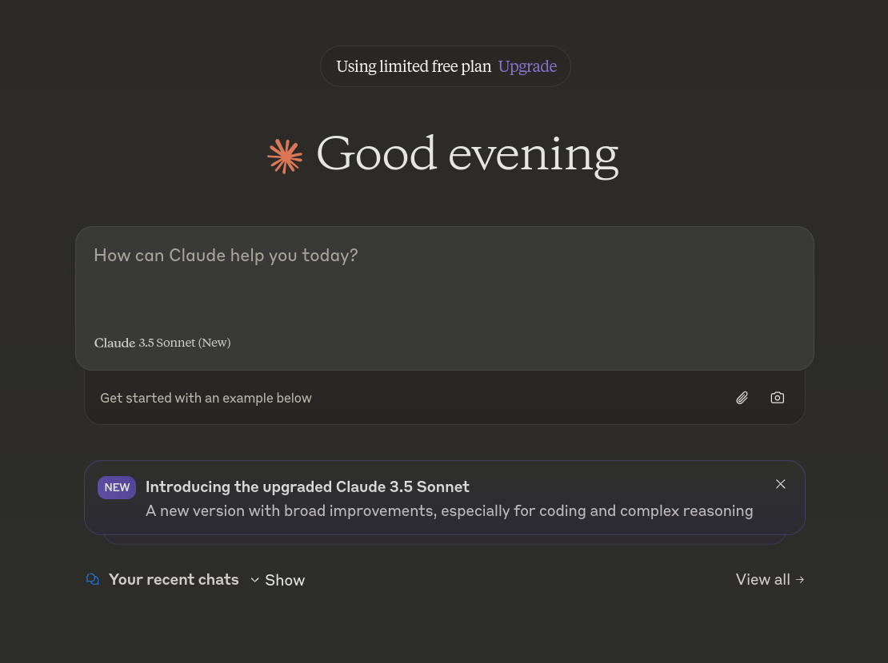

Claude AI developed by Anthropic is the closest rival to ChatGPT at the moment. In some benchmarks Claude even defeats the latter. Anthropic offers an AI chatbot powered by its family of Claude LLMs. Its large language models are named Haiku, Sonnet and Opus in an increasing order of the parameter size. Besides, there is a release number. The latest and greatest free version is Claude 3.5 Sonnet. But free usage is limited and at times *due to high demand*, Claude 3.5 Sonnet is not available. When Claude 3.5 Sonnet is not available, you can use Claude 3 Haiku. At the moment Claude chatbot can't access the internet to answer your prompts.

Link: [https://claude.ai/new](https://claude.ai/new)

#### Claude 3 Haiku

**Prompt 1:** What are centralized version control systems?

<details>
    <summary>
        Claude 3 Haiku' answer
    </summary>
    <br>
<blockquote>

I'll provide a comprehensive explanation of Centralized Version Control Systems (CVCS).

Definition:
A Centralized Version Control System (CVCS) is a version control approach where a single, central server stores and manages all versions of a project's files, providing a single point of access for all team members to collaborate on software development.

Key Characteristics:
1. Single Central Repository
- One main server hosts the entire project history
- All versioned files and change tracking are stored centrally
- Serves as the definitive source of truth for the project

2. Basic Structure
- Central Server: Stores all project versions and metadata
- Client Machines: Developers' computers that check out and work on project files
- Network Connection: Required to interact with the central repository

Core Functionality:
- Track file changes over time
- Maintain complete revision history
- Enable collaboration among team members
- Manage different versions of project files
- Control access to project resources

How It Works:
1. Repository Setup
- Project is initialized on a central server
- Initial project files and directory structure are established
- Access permissions are configured

2. Checkout Process
- Developers "check out" or clone the project from the central repository
- Receives a complete working copy of the project
- Can view, edit, and modify files locally

3. Commit Workflow
- Developers make changes to local files
- Changes are reviewed and committed to the central repository
- Commits create snapshots of project state at specific points in time

4. Version Tracking
- Each file change is tracked with:
  - Timestamp
  - Author information
  - Commit message
  - Unique revision number

5. Synchronization
- Developers update their local copy to get latest changes
- Resolve conflicts if multiple people modify same files

Popular CVCS Examples:
- Apache Subversion (SVN)
- Perforce
- Microsoft Team Foundation Version Control (TFVC)

Pros:
- Simple, straightforward model
- Easy to understand and implement
- Centralized control
- Clear access management
- Suitable for teams with structured workflows

Cons:
- Single point of failure
- Requires constant network connection
- Limited offline work capabilities
- Potential performance bottlenecks
- Less flexible compared to distributed systems

Typical Use Cases:
- Corporate environments with centralized development
- Projects requiring strict access control
- Small to medium-sized teams
- Organizations with robust network infrastructure

Comparison with Distributed Version Control:
- CVCS: Centralized, single repository
- Distributed (e.g., Git): Multiple repositories, more flexible

Basic SVN Workflow Example:
```bash
# Check out project
svn checkout http://repository-url/project

# Update local copy
svn update

# Commit changes
svn commit -m "Added new feature"

# View project history
svn log
```

Key Workflow Steps:
1. Connect to central repository
2. Download project files
3. Make local changes
4. Synchronize with server
5. Commit modifications
6. Resolve any conflicts

Would you like me to elaborate on any specific aspect of Centralized Version Control Systems?
</blockquote>
</details>

**Follow-up prompt:** Explain how centralized version control system works. Explain the workflow in detail.

<details>
    <summary>
        Claude 3 Haiku' answer
    </summary>
    <br>
<blockquote>

I'll explain how a Centralized Version Control System (CVCS) works, breaking down its key components and workflow in detail.

Centralized Version Control System Overview:
A Centralized Version Control System is a version control model where there is a single, central server that stores all versions of a project's files and the entire revision history. All team members interact with this central repository to access, modify, and track changes.

Key Components:
1. Central Repository
2. Server
3. Client Machines

Detailed Workflow:

1. Initial Setup
- The central server hosts the main repository with the project's complete history
- Developers create a local working copy by "checking out" the project from the central repository
- This checkout process downloads the latest version of the project files to the developer's local machine

2. Making Changes
- Developers work on files in their local working directory
- They can modify, add, or delete files as needed
- Local changes are not immediately reflected in the central repository

3. Committing Changes
- When a developer wants to save their changes, they "commit" their modifications
- A commit creates a snapshot of the current state of the files
- Each commit includes:
  - Modified files
  - Commit message describing the changes
  - Timestamp
  - Author information

4. Synchronization Process
- Before committing, developers typically first "update" their local copy
- This pulls the latest changes from the central repository
- Helps identify and resolve potential conflicts with other team members' work

5. Conflict Resolution
- If multiple developers modify the same file, the system will:
  - Detect conflicting changes
  - Prompt the developer to manually resolve conflicts
  - Require merging different versions of the file before allowing a commit

6. Branching and Merging
- Developers can create branches for:
  - Feature development
  - Experimental work
  - Bug fixes
- Branches are created and managed through the central server
- Merging branches requires coordination with the central repository

Example of Popular Centralized Version Control Systems:
- Apache Subversion (SVN)
- Perforce

Advantages:
- Simple, straightforward model
- Easy to understand and implement
- Clear access control
- Single source of truth
- Easy administrator management

Disadvantages:
- Single point of failure (central server)
- Requires constant network connection
- Slower operations
- Limited offline work capabilities
- Potential bottleneck with large teams or projects

Typical Use Cases:
- Small to medium-sized teams
- Projects with centralized workflow
- Environments requiring strict access control
- Organizations with robust network infrastructure

Workflow Example:
```
1. svn checkout http://repository-url/project
2. (Make changes locally)
3. svn update  # Get latest changes
4. svn commit -m "Description of changes"
```

Alternatives:
- Distributed Version Control Systems (like Git) offer more flexibility and offline capabilities

Would you like me to elaborate on any specific aspect of Centralized Version Control Systems?

</blockquote>
</details>

**My take:** Even though in its first answer, Haiku tried to give comprehensive answer it failed in multiple ways. It provided too many oftentimes overlapping and confusing points, the points it outlined lacked proper explanation. Among others the section "Comparison with Distributed Version Control" lacked details. The answer to the follow-up prompt is little clearer but it also introduces terms such as "branch" without any explanation.

**Rating:** 5.5/10


#### Claude 3.5 Sonnet

**Prompt 1:** What are centralized version control systems?

<details>
    <summary>
        Claude 3.5 Sonnet's answer
    </summary>
    <br>
<blockquote>
A centralized version control system (CVCS) is a type of software version control where all project files and their history are stored in a single central repository, typically on a server.

Here are the key characteristics of centralized version control:

1. Single Repository
- All files are stored in one central location
- Developers check out files from and commit changes back to this central server
- Examples include SVN (Subversion) and CVS (Concurrent Versions System)

2. Main Features
- Sequential version numbers for tracking changes
- Ability to lock files to prevent concurrent editing
- Branching and merging capabilities
- History tracking and version comparison

3. Workflow
- Developers must connect to the server to commit changes
- Each commit updates the central repository directly
- Other developers must update/sync to see latest changes

Advantages:
- Simpler to understand and manage
- Easier to control access and permissions
- Clear indication of which version is "official"

Disadvantages:
- Single point of failure (server downtime = no access)
- Network connection required for most operations
- Slower for large projects or distributed teams
- Limited offline work capabilities

This contrasts with distributed version control systems like Git, where each developer has a complete copy of the repository and its history locally.

Would you like me to explain more about any specific aspect of centralized version control?
</blockquote>
</details>

**Follow-up prompt:** Explain how centralized version control system works. Explain the workflow in detail.

<details>
    <summary>
        Claude 3.5 Sonnets' answer
    </summary>
    <br>
<blockquote>
Let me explain the detailed workflow of a centralized version control system.


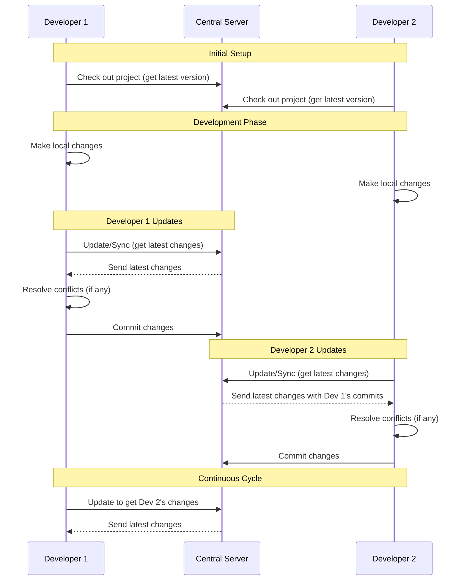

Here's how the centralized version control workflow operates in detail:

1. Initial Setup
   - The central server hosts the main repository with all project files
   - Developers get started by checking out (downloading) a working copy
   - Each developer now has a local copy of the project files

2. Basic Development Cycle
   a. Update/Sync
      - Before starting new work, developers sync with the server
      - This ensures they have the latest version of all files
      - Command example: `svn update` (in SVN)

   b. Make Changes
      - Developers modify files in their working copy
      - Changes are only local at this point
      - The server is not yet aware of these changes

   c. Review Changes
      - Developers can review their modifications
      - Check which files have been changed
      - Verify changes are correct before committing

   d. Commit Changes
      - Developer sends changes back to the central server
      - Each commit creates a new version number
      - Commit requires a message describing the changes
      - Command example: `svn commit -m "message"` (in SVN)

3. Conflict Resolution
   - If two developers modify the same file:
     1. Second developer must update before committing
     2. System attempts automatic merge
     3. If automatic merge fails, manual conflict resolution is required
     4. Developer must choose which changes to keep
     5. Resolved files can then be committed

4. Advanced Operations
   - File Locking
     - Developers can lock files for exclusive access
     - Prevents others from modifying locked files
     - Useful for binary files that can't be merged

   - Branching
     - Create separate line of development
     - Typically used for features or releases
     - All branches stored on central server

   - Merging
     - Combine changes from different branches
     - Always performed through central server
     - Can require conflict resolution

5. Best Practices
   - Update frequently to minimize conflicts
   - Make small, focused commits
   - Write clear commit messages
   - Lock files only when necessary
   - Resolve conflicts promptly

6. Common Commands (using SVN as example)
   ```
   svn checkout [URL]      # Get initial copy
   svn update             # Get latest changes
   svn status            # Check local changes
   svn diff              # View detailed changes
   svn commit            # Send changes to server
   svn lock/unlock       # Manage file locks
   svn merge            # Combine changes
   ```

7. Network Considerations
   - Most operations require server connection
   - Network issues can block development
   - Some operations can be slow over poor connections
   - Local copies provide limited offline capabilities

Would you like me to elaborate on any particular aspect of this workflow?

</blockquote>
</details>

**My take**: Although both ChatGPT and Gemini has a capability to generate images. Claude 3.5 Sonnet was the only AI chatbot that generated Graph. The first answer of the Claude 3.5 Sonnet lacked details and proper explanation. But its answer to the follow-up prompt was much better and it was accompined by a graph explaining the worklow. As it is said, a picture is worth a thousand words. But the answer mainly consisted of bullet points (lists) of short sentences. Overal, the answer is little inferior to the one generated by ChatGPT in certain aspects.

**Rating:** 7/10

**Extra Info:**

Similar to ChatGPT, you can retry the generation of the answer, i.e. make the claude generate a different answer to your prompt but you can't modify the answer easily like with Gemini. If you want to do so, you should explicitly do so via prompt engineering.

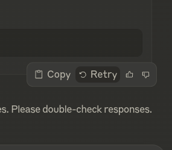


### Phind AI

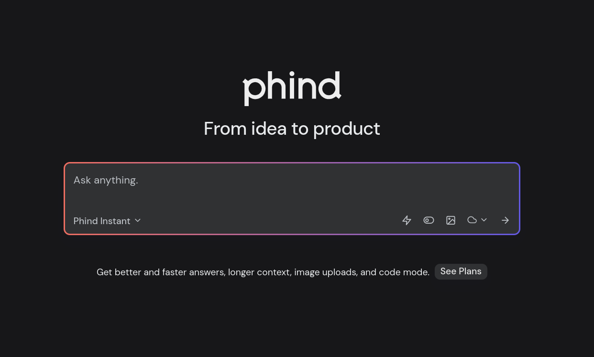

PhindAI chatbot has two models under its free tier: Phind-70B model that can be used to prompt 10 times within 24 hours and Phind Instant model that is limitless.

Phind AI chatbot is a little different compared to other chatbots; in its $20 per month Phind Pro subscription, this chatbot, in addition to using its own large language models, can serve as an interface for other LLMs developed by companies such as Anthropic and OpenAI with monthly quota for prompts.

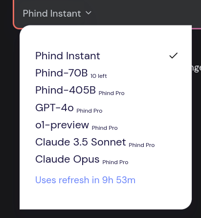

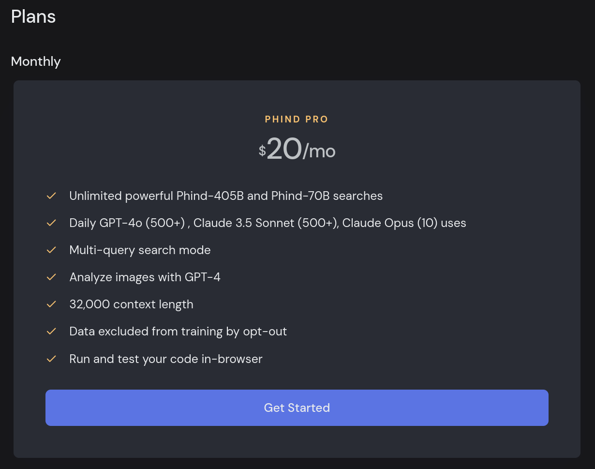

Anyway, this post is about free chatbots. Phind AI 70B and Phind Instant models can be used free of charge and both models **can access the internet**. In fact to answer your prompt, phind ai goes through 10 webpages as its source and lists the sources on the right hand side (by far the best indicator of the sources).

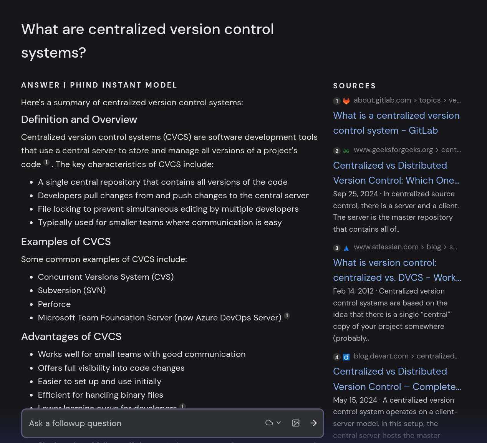

#### Phind AI 70B (10 fee prompts per 24 hours)

**Prompt 1:** What are centralized version control systems?

<details>
    <summary>
        Phind AI 70B's answer
    </summary>
    <br>
<blockquote>
Here are the key points about centralized version control systems:

### Definition and Basic Concept

- A centralized version control system uses a central server to store all versions of a project's code [1].

- Developers check out code from the central repository, make changes locally, and then commit those changes back to the central server [1][3].

### Advantages

- Easy to set up and understand, especially for smaller teams [1].

- Provides full visibility into what code is being worked on and what changes are made [1].

- Works well with binary files, as only necessary files need to be pulled from the server [1].

- Allows for file locking to prevent conflicts when multiple developers work on the same file [1].

### Disadvantages

- Single point of failure - if the central server goes down, no one can work on the code [1].

- Slower speeds due to needing to communicate with the remote server for every action [1].

- Can be challenging for larger teams to coordinate pushes and avoid conflicts [1].

- Limited offline capabilities [1].

### Examples

Common centralized version control systems include:

- Concurrent Versions System (CVS)
- Subversion (SVN)
- Perforce
- Microsoft Team Foundation Server (now Azure DevOps Server) [1]

### Comparison to Distributed Systems

- Unlike distributed systems like Git, centralized systems do not give each developer a full copy of the project history locally [2][3].

- Centralized systems require constant connectivity to the central server, while distributed systems allow offline work [3].

- Distributed systems provide more flexibility and scalability for larger projects and distributed teams [3].

In summary, centralized version control systems are simpler but have limitations in terms of scalability and offline capabilities compared to distributed systems. The choice depends on factors like team size, project requirements, and desired workflows.

Citations:
[1] https://about.gitlab.com/topics/version-control/what-is-centralized-version-control-system/
[2] https://www.geeksforgeeks.org/centralized-vs-distributed-version-control-which-one-should-we-choose/
[3] https://www.atlassian.com/blog/software-teams/version-control-centralized-dvcs
[4] https://blog.devart.com/centralized-vs-distributed-version-control.html
[5] https://stackoverflow.com/questions/111031/comparison-between-centralized-and-distributed-version-control-systems
[6] https://about.gitlab.com/blog/2020/11/19/move-to-distributed-vcs/
[7] https://www.digitalproductsdp.com/blog/centralized-version-control-systems
[8] https://www.reddit.com/r/git/comments/cz5r8q/which_is_better_centralized_vs_distributed/
[9] https://www.linkedin.com/pulse/differentiate-between-centralized-distributed-version-control-ejv2c
[10] https://www.daytona.io/definitions/c/cvcs
</blockquote>
</details>

**Follow-up prompt:** Explain how centralized version control system works. Explain the workflow in detail.

<details>
    <summary>
        Phind AI 70B's answer
    </summary>
    <br>
<blockquote>
Here's a detailed explanation of how a centralized version control system works and its typical workflow:

### Centralized Version Control System Structure

A centralized version control system consists of:

1. A central server that hosts the main repository
2. Client machines used by developers to interact with the repository

### Typical Workflow

1. Initial Setup:
   - The central repository is created on the server
   - Developers install the version control client software on their local machines

2. Checking Out Code:
   - Developers "check out" the latest version of the code from the central repository
   - This creates a local copy of the code on the developer's machine

3. Making Changes:
   - Developers modify the code locally on their machines
   - They can create new files, edit existing ones, or delete files as needed

4. Committing Changes:
   - When a developer finishes making changes, they "commit" those changes
   - The commit operation sends the changes to the central repository
   - The central repository updates its version of the code with the committed changes

5. Updating Local Copy:
   - Before starting new work, developers typically "update" their local copy
   - This retrieves any changes made by other developers since the last checkout

6. Resolving Conflicts:
   - If multiple developers modify the same file, conflicts may occur
   - The version control system alerts developers to these conflicts
   - Developers must manually resolve conflicts before committing changes

7. Branching and Merging:
   - Large projects often use branches to isolate different features or versions
   - Changes made in a branch can later be merged back into the main trunk

8. Tagging Releases:
   - Significant versions of the code can be tagged for future reference
   - Tags allow quick retrieval of specific versions of the codebase

### Key Points About Centralized Systems

- All developers work off a single, shared repository
- Changes are immediately visible to all team members upon commit
- File locking mechanisms can be used to prevent simultaneous edits
- Offline work is limited, as most operations require connection to the server
- Backup and disaster recovery are centralized, reducing complexity

### Advantages

- Simple setup and understanding for small teams
- Full visibility into who is working on what
- Efficient handling of binary files
- Easy to set up access controls and permissions

### Disadvantages

- Single point of failure - if the central server goes down, no one can work
- Slower speeds due to constant communication with the server
- Limited offline capabilities
- Can be challenging for larger distributed teams

Centralized version control systems like CVS, SVN, and Perforce were widely used before the advent of distributed systems like Git. While they still have their place in certain scenarios, distributed systems have gained popularity due to their flexibility and scalability for larger projects and distributed teams.

Citations:
[1] https://about.gitlab.com/topics/version-control/what-is-centralized-version-control-system/
[2] https://www.geeksforgeeks.org/centralized-vs-distributed-version-control-which-one-should-we-choose/
[3] https://www.digitalproductsdp.com/blog/centralized-version-control-systems
[4] https://www.atlassian.com/blog/software-teams/version-control-centralized-dvcs
[5] https://www.perforce.com/blog/vcs/what-is-version-control
[6] https://git-scm.com/book/ms/v2/Getting-Started-About-Version-Control
[7] https://blog.devart.com/centralized-vs-distributed-version-control.html
[8] https://about.gitlab.com/blog/2020/11/19/move-to-distributed-vcs/
[9] https://homes.cs.washington.edu/~mernst/advice/version-control.html
[10] https://ucdavisdatalab.github.io/workshop_introduction_to_version_control/version-control.html
</blockquote>
</details>


**My take:** In its first answer, phind 70b says "A centralized version control system uses a central server to store all versions of a project's code". So this CVC system uses a central server, but what is it ? It doesn't explain it properly. The answer to the second prompt is much better but lacks depth at certain points.

**Rating:** 5.5-6/10

####  Phind AI Instant

**Prompt 1:** What are centralized version control systems?

<details>
    <summary>
        Phind AI Instant's answer
    </summary>
    <br>
<blockquote>
Here's a summary of centralized version control systems:

### Definition and Overview

Centralized version control systems (CVCS) are software development tools that use a central server to store and manage all versions of a project's code [1]. The key characteristics of CVCS include:

- A single central repository that contains all versions of the code
- Developers pull changes from and push changes to the central server
- File locking to prevent simultaneous editing by multiple developers
- Typically used for smaller teams where communication is easy

### Examples of CVCS

Some common examples of CVCS include:

- Concurrent Versions System (CVS)
- Subversion (SVN)
- Perforce
- Microsoft Team Foundation Server (now Azure DevOps Server) [1]

### Advantages of CVCS

- Works well for small teams with good communication
- Offers full visibility into code changes
- Easier to set up and use initially
- Efficient for handling binary files
- Lower learning curve for developers [1]

### Disadvantages of CVCS

- Single point of failure - if the central server goes down, no one can work
- Can be slower due to frequent communication with the server
- Less flexible workflow customization
- Fewer stable moments to push changes when multiple developers want to edit the same code [1]

### Workflow

The typical workflow for CVCS involves:

1. Pulling the latest changes from the central server
2. Making local edits
3. Committing changes to the central server
4. Resolving merge conflicts on the central repository [1]

### Comparison to Distributed VCS

While CVCS uses a central repository, distributed version control systems (DVCS) like Git allow each developer to have a full copy of the entire project history locally. This provides more flexibility and redundancy, but can be more complex to use [2].

In summary, CVCS is a traditional approach that works well for smaller teams, but DVCS has become more popular in recent years due to its flexibility and reliability. The choice depends on the specific needs and preferences of the development team.

Citations:
[1] https://about.gitlab.com/topics/version-control/what-is-centralized-version-control-system/
[2] https://www.geeksforgeeks.org/centralized-vs-distributed-version-control-which-one-should-we-choose/
[3] https://www.atlassian.com/blog/software-teams/version-control-centralized-dvcs
[4] https://blog.devart.com/centralized-vs-distributed-version-control.html
[5] https://stackoverflow.com/questions/111031/comparison-between-centralized-and-distributed-version-control-systems
[6] https://about.gitlab.com/blog/2020/11/19/move-to-distributed-vcs/
[7] https://www.digitalproductsdp.com/blog/centralized-version-control-systems
[8] https://www.linkedin.com/pulse/differentiate-between-centralized-distributed-version-control-ejv2c
[9] https://www.tutorialspoint.com/difference-between-centralized-version-control-and-distributed-version-control
[10] https://www.reddit.com/r/git/comments/cz5r8q/which_is_better_centralized_vs_distributed/
</blockquote>
</details>

**Follow-up prompt:** Explain how centralized version control system works. Explain the workflow in detail.

<details>
    <summary>
        Phind AI Instant's answer
    </summary>
    <br>
<blockquote>
Here's a detailed explanation of how centralized version control systems work and their workflow:

### How Centralized Version Control Systems Work

Centralized version control systems (CVCS) use a client-server model where:

1. There is a central server that stores all versions of the code [1].
2. All developers interact with this central server to check out, modify, and commit changes [1].
3. The server acts as the main repository, containing all versions of the code [1].

Key components of a CVCS include:

- A central server hosting the main repository
- Client applications installed on developers' machines
- Network connectivity between clients and the server

### Workflow in Detail

The typical workflow for a CVCS involves the following steps:

1. **Initial Setup**:
   - Developers install client software on their machines
   - They connect to the central server using credentials [1]

2. **Checking Out Changes**:
   - Developers pull the latest changes from the central repository
   - This creates a local copy of the current state of the project [1]

3. **Making Local Edits**:
   - Developers make changes to the code on their local machine
   - These changes are not yet shared with others [1]

4. **Committing Changes**:
   - Developers commit their local changes to the central repository
   - This makes the changes visible to other team members [1]

5. **Resolving Merge Conflicts**:
   - If multiple developers made changes to the same file, conflicts may arise
   - Developers resolve these conflicts manually [1]

6. **Updating Local Repository**:
   - After resolving conflicts, developers update their local repository
   - This ensures they have the latest version of the project [1]

### Key Points to Consider

- File Locking: CVCS typically uses file locking to prevent simultaneous editing by multiple developers [1].
- Branches: While not as flexible as DVCS, CVCS allows the creation of branches for feature development [1].
- Visibility: All changes are stored in the central repository, providing full visibility to all team members [1].
- Learning Curve: CVCS generally has a lower learning curve compared to distributed systems [1].

### Advantages of CVCS

- Works well for small teams with good communication [1]
- Efficient for handling binary files [1]
- Easier to set up and use initially [1]
- Lower learning curve for developers [1]

### Disadvantages of CVCS

- Single point of failure - if the central server goes down, no one can work [1]
- Can be slower due to frequent communication with the server [1]
- Less flexible workflow customization [1]
- Fewer stable moments to push changes when multiple developers want to edit the same code [1]

In summary, centralized version control systems provide a straightforward approach to managing collaborative development projects, especially suitable for smaller teams. However, they may face challenges in larger, more complex projects where flexibility and redundancy become crucial.

Citations:
[1] https://about.gitlab.com/topics/version-control/what-is-centralized-version-control-system/
[2] https://www.digitalproductsdp.com/blog/centralized-version-control-systems
[3] https://www.atlassian.com/blog/software-teams/version-control-centralized-dvcs
[4] https://www.geeksforgeeks.org/centralized-vs-distributed-version-control-which-one-should-we-choose/
[5] https://www.perforce.com/blog/vcs/what-is-version-control
[6] https://stackoverflow.com/questions/2704996/describe-your-workflow-of-using-version-control-vcs-or-dvcs
[7] https://homes.cs.washington.edu/~mernst/advice/version-control.html
[8] https://git-scm.com/book/ms/v2/Getting-Started-About-Version-Control
[9] https://blog.devart.com/centralized-vs-distributed-version-control.html
[10] https://stackoverflow.com/questions/111031/comparison-between-centralized-and-distributed-version-control-systems
</blockquote>
</details>

**My take:** The answer was a little better than the one generated use-limited Phind-70B model. However it lacked some depth and emphasis. For example one of the key points of CVCS is a user/developer can have only a latest copy of the file/files not a full history of the file/files.

**Rating:** 6-6.5/10

### Microsoft Copilot

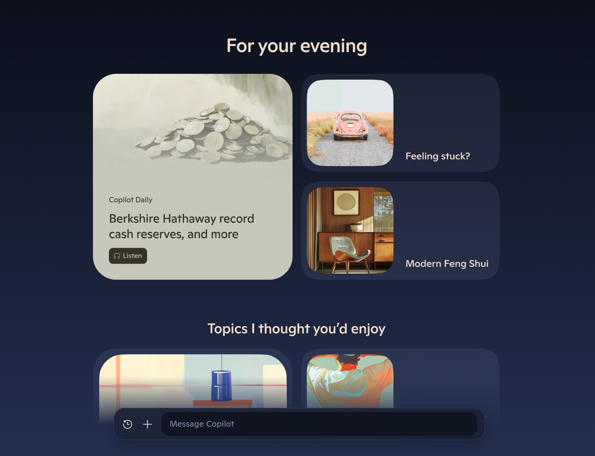

Microsoft Copilot chatbot is powered by OpenAI's GPT model. But it is not just another interface for ChatGPT. Microsft seems to have implemented some modifications onto how the model generates answers.


Link: [https://copilot.microsoft.com/](https://copilot.microsoft.com/)

**Prompt 1:** What are centralized version control systems?

<details>
    <summary>
        Microsoft Copilot's answer
    </summary>
    <br>
<blockquote>

Centralized version control systems (CVCS) are like single libraries where all your files live. Imagine a master copy of a book stored in one place, and everyone gets their chapters from this single source. Whenever someone wants to make changes, they need to check out the chapters, edit them, and then check them back in. The main repository is the single point of truth. Systems like CVS or Subversion work this way. What’s gotten you curious about version control systems?
</blockquote>
</details>

**Follow-up prompt:** Explain how centralized version control system works. Explain the workflow in detail.

<details>
    <summary>
        Microsoft Copilot's answer
    </summary>
    <br>
<blockquote>

Alright, picture this:

1. Single Central Repository: The centralized version control system has a single repository that acts as the central point where all the files and their version history are stored.

1. Check-Out Process: Developers "check out" files from this central repository. This means they're copying the files to their local machines to work on them. It's like borrowing a book from a library.

1. Making Changes: Once they have the files locally, they can edit them as they need. These changes are made in their local copies, not in the central repository.

1. Check-In Process: After making their changes, developers "check in" the files back to the central repository. This step updates the files in the repository with the changes they've made. It's like returning a borrowed book with your own notes added to it.

1. Version History: The repository keeps a version history of every file, so you can always go back and see who made what changes and when. If needed, you can revert to previous versions of the files.

1. Conflict Resolution: If two developers are working on the same file and make different changes, the system has a mechanism to resolve these conflicts. It can either merge the changes automatically if they're in different parts of the file, or ask the developers to manually resolve conflicts.

1. Locking Mechanism: Sometimes, to avoid conflicts, the system allows a file to be "locked" so only one developer can make changes to it at a time.

In essence, centralized version control keeps everything in one place, making it easier to manage, but it also means that if the central server goes down, no one can access the files. What's got you into digging deep into version control? Work project or just geeky curiosity? 😉
</blockquote>
</details>


**My take:** The explanation to the second prompt was better than the first answer, with good analogy that makes the concept easier to understand. However the answer to the first prompt is short, and lacks details and proper explanation. For example what on earth "single libraries" mean? The second answer, albeit better than the first answer, still lacks depth and details. In this regard it seems to use Microsoft Copilot effectively more prompt engineering skill is required.

**Rating:** 4/10

### Perplexity AI

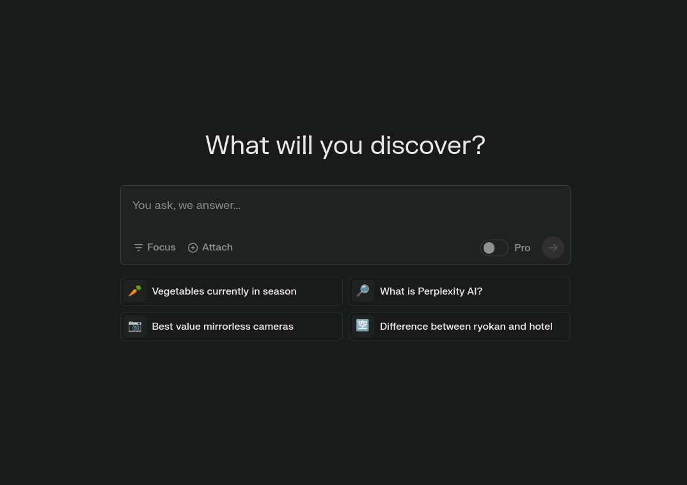

Perplexity AI is gaining popularity as an AI-powered search engine. It searches internet to answer your prompts. As of now it uses 8 webpages as sources to form its answer.

Link: [https://www.perplexity.ai/](https://www.perplexity.ai/)

**Prompt 1:** What are centralized version control systems?

<details>
    <summary>
        Perplexity AI's answer
    </summary>
    <br>
<blockquote>
Centralized version control systems (CVCS) are a type of version control system used in software development to manage and track changes to codebases. Here are the key characteristics and aspects of centralized version control systems:

## Core Concept

A centralized version control system operates on a client-server model, where there is a single central repository that stores the entire version history of the project[1][3]. This central server acts as the main source of truth for the codebase.

## Key Features

- **Single Repository**: All versions of the code are stored in one central location[3].
- **Check-out/Check-in Model**: Developers check out files from the central server to work on them locally, then check them back in when done[4].
- **File Locking**: Only one developer can modify a specific piece of code at a time, as the system locks the file to prevent conflicts[1].
- **Branching**: Team members can create branches to work independently, but all changes are eventually committed to the central repository[1].

## Workflow

1. Developers pull the latest version from the central server to their local machine.
2. They make modifications to the code locally.
3. Once changes are complete, they commit these changes back to the central repository.
4. The server resolves any conflicts and merges the updates[3].

## Advantages

- **Simplicity**: Easier to understand and use, especially for beginners[3].
- **Visibility**: Provides full visibility into what code is being worked on and what changes are made[3].
- **Binary File Handling**: Works well with large binary files, as developers don't need to download the entire project history[3].
- **Access Control**: Easier to implement access controls and permissions[2].

## Disadvantages

- **Single Point of Failure**: If the central server goes down, no one can work or access version history[3].
- **Network Dependency**: Requires network access to perform most operations[1].
- **Limited Offline Work**: Developers can't commit changes or access full history when offline[3].

## Popular Examples

Some well-known centralized version control systems include:

- Subversion (SVN)
- CVS (Concurrent Versions System)
- Perforce
- Microsoft Team Foundation Server (now Azure DevOps Server)[3]

Centralized version control systems are often contrasted with distributed version control systems like Git, which provide each developer with a full copy of the repository and history on their local machine.

Citations:
[1] https://blog.devart.com/centralized-vs-distributed-version-control.html
[2] https://www.digitalproductsdp.com/blog/centralized-version-control-systems
[3] https://about.gitlab.com/topics/version-control/what-is-centralized-version-control-system/
[4] https://www.daytona.io/definitions/c/cvcs
[5] https://www.geeksforgeeks.org/centralized-vs-distributed-version-control-which-one-should-we-choose/
[6] https://groups.oist.jp/scs/version-control-system-vcs
[7] https://about.gitlab.com/blog/2020/11/19/move-to-distributed-vcs/
[8] https://www.linkedin.com/pulse/differentiate-between-centralized-distributed-version-control-ejv2c
</blockquote>
</details>

**Follow-up prompt:** Explain how centralized version control system works. Explain the workflow in detail.

<details>
    <summary>
        Perplexity AI's answer
    </summary>
    <br>
<blockquote>
Centralized version control systems (CVCS) operate on a client-server model, providing a single central repository that stores the entire version history of a project. Here's a detailed explanation of how CVCS works and its typical workflow:

## Core Concept

In a CVCS, there is one main server that hosts the central repository. This repository contains all versions of the project's files, including the complete history of changes. Developers interact with this central server to manage and track changes to the codebase[1][3].

## Workflow

The typical workflow in a centralized version control system involves the following steps:

1. **Initial Setup**:
   - The central repository is set up on a server.
   - Developers create accounts and are granted appropriate access rights.

2. **Checkout**:
   - Developers start by checking out the latest version of the project from the central server.
   - This creates a local working copy of the files on their machines[1][3].

3. **Local Changes**:
   - Developers make modifications to their local copy of the files.
   - These changes are initially only on the developer's local machine.

4. **Update**:
   - Before committing changes, developers usually update their local copy.
   - This pulls down any changes other team members have made to the central repository[3].

5. **Conflict Resolution**:
   - If there are conflicts between the local changes and the updates from the server, the developer must resolve these conflicts manually.

6. **Commit**:
   - Once changes are complete and conflicts (if any) are resolved, developers commit their changes to the central repository.
   - Each commit includes a message describing the changes made[1].

7. **Server Processing**:
   - The central server receives the commit and processes it.
   - It resolves any remaining conflicts and merges the updates into the main codebase[1].

8. **File Locking**:
   - In some CVCS, the system may lock files that are being edited to prevent simultaneous modifications by multiple users[1].

9. **Branching** (if needed):
   - Developers can create branches for independent work.
   - All branches are stored on the central server[1].

10. **Merging**:
    - When work on a branch is complete, it is merged back into the main line of development on the central server.

11. **Version History**:
    - The central server maintains the complete version history.
    - Developers can view past versions and revert to earlier states if needed[1].

## Continuous Integration

CVCS integrates closely with development pipelines:
- Commits to the central repository can trigger automated builds and tests.
- Continuous integration systems regularly pull the latest code to perform builds and run automated tests[1].

## Release Management

CVCS aids in release management:
- Teams can create release branches to stabilize code.
- Specific commits can be tagged to mark release points.
- Release notes can be generated by comparing tagged versions[1].

## Advantages

- Simplicity: Easy to understand and use, especially for beginners.
- Visibility: Provides full visibility into what code is being worked on and what changes are made.
- Access Control: Easier to implement access controls and permissions[2].

## Disadvantages

- Single Point of Failure: If the central server goes down, no one can work or access version history.
- Network Dependency: Requires network access to perform most operations.
- Limited Offline Work: Developers can't commit changes or access full history when offline[2][3].

Centralized version control systems like Subversion (SVN), CVS, and Perforce have been widely used in software development. While they have some limitations compared to distributed systems, they still offer a straightforward and effective way to manage code for many teams, especially those working with large binary files or requiring strict access controls[4].

Citations:
[1] https://www.digitalproductsdp.com/blog/centralized-version-control-systems
[2] https://blog.devart.com/centralized-vs-distributed-version-control.html
[3] https://www.atlassian.com/blog/software-teams/version-control-centralized-dvcs
[4] https://about.gitlab.com/topics/version-control/what-is-centralized-version-control-system/
[5] https://git-scm.com/book/ms/v2/Getting-Started-About-Version-Control
[6] https://www.daytona.io/definitions/c/cvcs
[7] https://learn.microsoft.com/is-is/azure/devops/repos/tfvc/what-is-tfvc?view=azure-devops-2022
[8] https://www.geeksforgeeks.org/centralized-vs-distributed-version-control-which-one-should-we-choose/
</blockquote>
</details>

**My take:** The answer lacks details, mainly consists of sentence bullet points. It introduced terms "commit" and "branch" without proper explanation.

**Rating:** 6/10

### HuggingChat Interface

All the ai chatbots covered so far  were based on closed-source AI models. Even though it doesn't make much of a difference to a average user, if knowing whether the AI chatbot is powered by open-source or closed-source LLM, below chatbots are powered by open-source or *to-some-extent* open source LLMs.

HuggingFace provides HuggingChat interface in which you can use several LLMs. As of writing this post, eight models are supported.

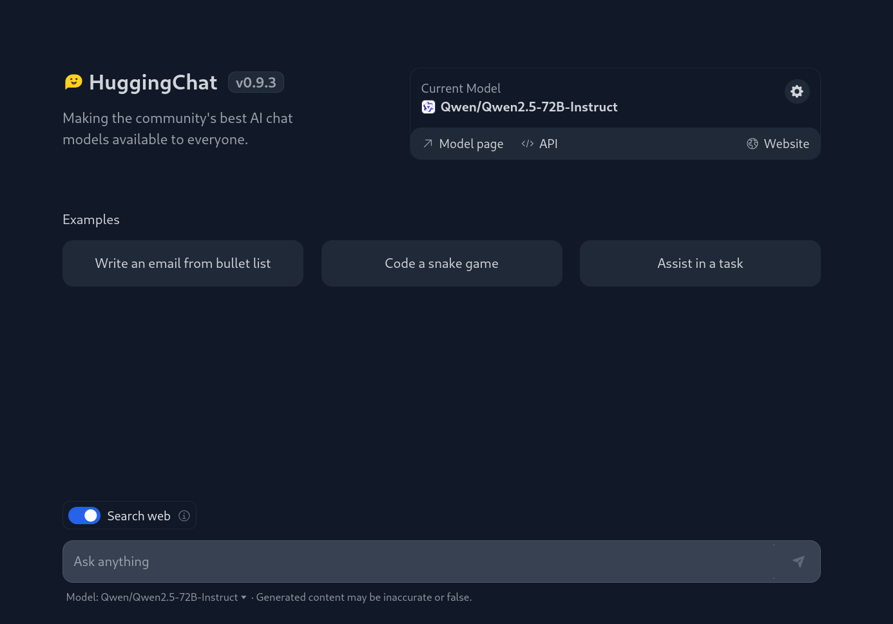

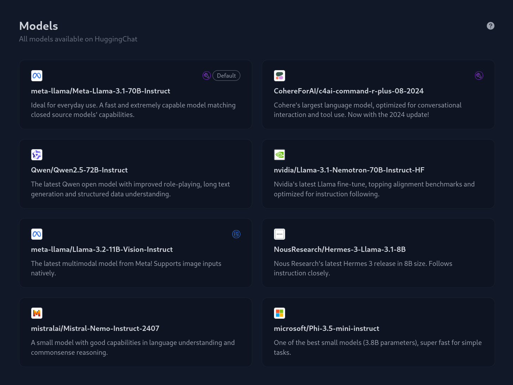

Link: [https://huggingface.co/chat/](https://huggingface.co/chat/)

### Hermes-3-Llama-3.1-8B

Llama-3.1-8B by NousResearch can search the web to form its answers.

**Prompt 1:** What are centralized version control systems?

<details>
    <summary>
        Hermes-3-Llama-3.1-8B's answer
    </summary>
    <br>
<blockquote>
Based on the search results, centralized version control systems (CVCS) are a type of version control system where a single central server stores all the versions and changes to the files in a project. In this system, developers check out files from the central repository to make changes, and the changes are committed back to the same central location.

Key characteristics of centralized version control systems include:

1. A single central repository that stores the entire history and current version of the project.
2. Developers rely on a network connection to the central server to check out files, make changes, and commit modifications.
3. Central server acts as the single source of truth for the project's codebase.
4. If the central server goes down, it can impede the ability of developers to collaborate and make changes.
5. The central repository also acts as a single point of failure - if it is compromised or lost, the entire history of the project could be jeopardized.

Some popular examples of centralized version control systems mentioned include Subversion (SVN) and Perforce (Helix Core). The main benefits are easy management and tracking of file versions, as well as quick access to the most recent files for team members. However, the reliance on a central server is a disadvantage, as it can create a bottleneck and cause accessibility issues if the server goes down or is compromised.
</blockquote>
</details>

**Follow-up prompt:** Explain how centralized version control system works. Explain the workflow in detail.

<details>
    <summary>
        Hermes-3-Llama-3.1-8B's answer
    </summary>
    <br>
<blockquote>
Based on the search results, a centralized version control system (CVCS) is a type of version control system where all project files and their versions are stored in a central repository. Developers create local copies of the project, known as "working copies" or "checkouts," on their machines. They can make modifications to these working copies and commit their changes back to the central repository. The workflow in a centralized version control system typically follows these steps:

1. **Check out**: A developer checks out a copy of the project from the central repository to their local machine. This creates a working copy that they can modify.

2. **Make changes**: The developer makes changes or additions to the files in their working copy.

3. **Commit**: When the developer is satisfied with their changes, they commit them back to the central repository. This action records the changes and updates the project history.

4. **Update**: Other developers can update their local working copies by pulling the latest changes from the central repository. This ensures that everyone's working copy reflects the most recent changes made by others.

5. **Merge**: In case of conflicts between changes made by multiple developers, one of the developers with commit access must resolve the conflict and commit the merged changes to the central repository.

6. **Release**: Once the changes are committed to the central repository, they become part of the official project version, and other developers can continue working on their tasks.

The main advantage of centralized version control systems is that they provide a single source of truth for the project's codebase, making it easier to manage and track changes. However, the reliance on a central server can also be a disadvantage, as it creates a single point of failure and can cause accessibility issues if the server goes down or is compromised.
</blockquote>
</details>


**My take:** In a few words, not quite there. Answer lacks details and features such as locking.

**Rating:** 5/10

### Llama-3.2-11B-Vision-Instruct

Llama, a family of large language models is developed by Meta (formerly Facebook). This model too incorporates its findings from web search into its answers.

**Prompt 1:** What are centralized version control systems?

<details>
    <summary>
        Llama-3.2-11B-Vision-Instruct's answer
    </summary>
    <br>
<blockquote>
Centralized version control systems (CVCS) are a type of version control system where all changes to a project's files are stored in a single, central repository. This repository acts as a single point of truth for the project's history and current state. In a CVCS, developers check out files from the central repository to make changes, and changes are committed back to the same location.

In a CVCS, all users have access to the central repository, and changes are synced to the central server. This means that every user has quick access to the latest version of a file, reducing the possibility of overwriting each other's work, duplicating effort, or wasting effort by making changes to files that cannot be merged.

Examples of centralized version control systems include CVS, Subversion (SVN), and Perforce.
</blockquote>
</details>

**Follow-up prompt:** Explain how centralized version control system works. Explain the workflow in detail.

<details>
    <summary>
        Llama-3.2-11B-Vision-Instruct's answer
    </summary>
    <br>
<blockquote>
Based on the search results, I'll provide a detailed explanation of how centralized version control systems work and their workflow.

**How Centralized Version Control System Works:**

In a centralized version control system, there is a single central repository that stores all the project files. This central repository acts as a single point of truth for the project's history and current state. Here's a step-by-step explanation of how it works:

1. **Checking out files**: Developers check out files from the central repository to make changes. This creates a local copy of the files on their machine.
2. **Making changes**: Developers make changes to the files and test them to ensure they work properly.
3. **Committing changes**: When the changes are ready, developers commit them back to the central repository. This records the changes in the central system.
4. **Pushing changes**: The committed changes are then pushed to the central server, which updates the central repository.
5. **Pulling changes**: Other developers can pull down the changes from the central server to update their local copies of the files.

**Workflow in Detail:**

Here's a detailed workflow for adding a new feature or fixing a bug in a centralized version control system:

1. **Pull down any changes**: Before starting work, a developer pulls down any changes other people have made from the central server. This ensures they have the latest version of the project files.
2. **Make changes**: The developer makes changes to the files and tests them to ensure they work properly.
3. **Commit changes**: When the changes are ready, the developer commits them to the central repository, recording the changes in the central system.
4. **Push changes**: The committed changes are then pushed to the central server, which updates the central repository.
5. **Merge changes**: If multiple developers have made changes to the same files, their changes need to be merged. This can be done manually or automatically using a version control system.
6. **Test and verify**: The changes are tested and verified to ensure they work properly and don't break anything else in the project.
7. **Release**: Once the changes are verified, they can be released to production.

**Advantages of Centralized Version Control System:**

While centralized version control systems have some limitations, they offer several advantages, including:

* Simplified collaboration: Centralized version control systems make it easy for multiple developers to collaborate on a project.
* Version history: Centralized version control systems maintain a complete history of all changes, making it easy to track changes and revert to previous versions if needed.
* Reduced conflicts: Centralized version control systems minimize conflicts between developers, as all changes are recorded in a central location.

However, centralized version control systems have some limitations, including:

* Single point of failure: If the central server goes down, the entire project is unavailable.
* Limited scalability: Centralized version control systems can become slow and unwieldy as the project grows in size.
* Limited flexibility: Centralized version control systems can be inflexible, making it difficult to adapt to changing project requirements.
</blockquote>
</details>


**My take:** This answer has big serious flaws. It mixes up Distributed Version Control Systems with Centralized Version Control Systems. In short, in DVCS commits are pushed, while in CVCS commits are directly made against central repository, so there is no separate push action.

**Rating:** 0/10

### Meta-Llama-3.1-70B-Instruct

Meta-Llama-3.1-70B-Instruct cannot access the internet.

**Prompt 1:** What are centralized version control systems?

<details>
    <summary>
        Meta-Llama-3.1-70B-Instruct's answer
    </summary>
    <br>
<blockquote>
Centralized version control systems (CVCS) are a type of version control system where all the version history and metadata are stored in a single, central repository. This central repository is the single source of truth, and all developers working on a project must access and update the codebase through this central repository.

Here are some key characteristics of centralized version control systems:

1. **Single central repository**: There is only one central repository that stores all the version history and metadata.
2. **Client-server architecture**: Developers' local machines (clients) connect to the central repository (server) to access and update the codebase.
3. **Locking mechanism**: When a developer checks out a file or a set of files, they are locked to prevent others from modifying them simultaneously.
4. **Centralized access control**: The central repository manages access control, and administrators can restrict who can access, read, or write to the repository.

Examples of centralized version control systems include:

1. CVS (Concurrent Versions System)
2. SVN (Subversion)
3. Perforce

Advantages of centralized version control systems:

1. **Easy to manage**: Centralized access control and a single repository make it easier to manage the codebase and track changes.
2. **Simple workflow**: Developers can easily check out, modify, and commit changes to the central repository.
3. **Good for small teams**: CVCS is suitable for small teams or projects with a simple workflow.

Disadvantages of centralized version control systems:

1. **Single point of failure**: If the central repository becomes unavailable, no one can access or update the codebase.
2. **Scalability issues**: As the team size grows, the central repository can become a bottleneck, leading to slower performance.
3. **Difficult to collaborate**: Multiple developers working on the same file can lead to conflicts and delays.

Centralized version control systems have largely been replaced by distributed version control systems (DVCS), such as Git, Mercurial, and Bitbucket, which offer greater flexibility, scalability, and collaboration features.
</blockquote>
</details>

**Follow-up prompt:** Explain how centralized version control system works. Explain the workflow in detail.

<details>
    <summary>
        Meta-Llama-3.1-70B-Instruct's answer
    </summary>
    <br>
<blockquote>
Here's a detailed explanation of how a centralized version control system (CVCS) works, using the workflow as an example:

**Overview**

In a centralized version control system, a single central repository is created to store all the version history and metadata of a project. Developers working on the project use client software to connect to the central repository, check out files, make changes, and commit those changes back to the central repository.

**Workflow**

Here's the step-by-step workflow of a centralized version control system:

**Step 1: Create a Central Repository**

1. A central repository is created on a server, which will store all the version history and metadata of the project.
2. The repository is typically created using a version control system software, such as CVS or SVN.

**Step 2: Developer Checks Out Files**

1. A developer uses a client software (e.g., CVS or SVN client) to connect to the central repository.
2. The developer checks out a copy of the files they want to work on, which are stored in a local working directory on their machine.
3. The client software creates a local copy of the files and establishes a connection to the central repository.

**Step 3: Make Changes**

1. The developer makes changes to the files in their local working directory.
2. The changes can include editing existing files, adding new files, or deleting files.

**Step 4: Update Local Working Directory**

1. Before committing changes, the developer updates their local working directory to ensure it's up-to-date with the central repository.
2. The client software checks for any changes made by other developers and updates the local working directory accordingly.

**Step 5: Lock Files (Optional)**

1. If the version control system uses a locking mechanism, the developer may need to lock the files they're working on to prevent others from modifying them simultaneously.
2. When a file is locked, other developers cannot check out or modify that file until the lock is released.

**Step 6: Commit Changes**

1. Once the developer is ready to commit their changes, they use the client software to send the changes to the central repository.
2. The client software creates a new version of the files in the central repository, which includes the changes made by the developer.
3. The central repository updates its version history and metadata to reflect the new changes.

**Step 7: Release Lock (Optional)**

1. If the developer locked files in Step 5, they must release the lock after committing their changes.
2. Releasing the lock allows other developers to check out and modify the files.

**Step 8: Update Central Repository**

1. The central repository is updated with the new changes, and the version history is updated to reflect the changes.
2. The central repository becomes the single source of truth for the project, and all developers must access and update the codebase through this repository.

**Step 9: Repeat**

1. The workflow repeats itself as developers continue to check out files, make changes, and commit those changes back to the central repository.

**Key Concepts**

* **Checkout**: The process of retrieving a copy of files from the central repository to a local working directory.
* **Commit**: The process of sending changes made to the local working directory back to the central repository.
* **Lock**: A mechanism to prevent multiple developers from modifying the same file simultaneously.
* **Update**: The process of ensuring the local working directory is up-to-date with the central repository.

**Centralized Version Control System Software**

Some popular centralized version control system software includes:

* CVS (Concurrent Versions System)
* SVN (Subversion)
* Perforce

These software systems provide the tools and infrastructure to manage the central repository and facilitate the workflow described above.
</blockquote>
</details>


**My take:** In its first answer it made a big mistake, "Locking mechanism: When a developer checks out a file or a set of files, they are locked to prevent others from modifying them simultaneously.". The answer says that files are locked automatically when they are chekd out. But as it is clarified in the second asnwer, locking is an optional feature and it is not an automatic.

**Rating:** 2/10

### CohereForAI/c4ai-command-r-plus-08-2024

**Prompt 1:** What are centralized version control systems?

<details>
    <summary>
        CohereForAI's answer
    </summary>
    <br>
<blockquote>
Centralized version control systems (CVCSs) are a type of version control system where a central server stores the definitive repository, and clients synchronize with that server. This allows users to collaborate on a project by sharing a single source of truth.

In a centralized version control system, each user "checks out" a working copy of the project from the central repository, makes changes to their local copy, and then "commits" those changes back to the central repository. The version control system keeps track of the changes made by each user and maintains a history of all revisions.

Examples of centralized version control systems include Concurrent Versions System (CVS), Subversion (SVN), and Perforce. These systems have been widely used in software development for many years, but they have some limitations, such as the requirement for a constant network connection to the central server and the potential for the central repository to become a single point of failure.

To address these limitations, distributed version control systems (DVCSs) were developed, which allow users to have a local copy of the entire repository, including the full history of changes. This enables users to work offline and collaborate more flexibly, as they can create branches, merge changes, and resolve conflicts locally before pushing their changes to a remote repository. Git is a popular example of a distributed version control system.
</blockquote>
</details>

**Follow-up prompt:** Explain how centralized version control system works. Explain the workflow in detail.

<details>
    <summary>
        CohereForAI's answer
    </summary>
    <br>
<blockquote>
A centralized version control system is a type of system where a central repository serves as the main hub for all the files and changes made by different users. It is a traditional approach to version control and is widely used in software development. Here's how it works and the typical workflow:

1. Central Repository: In a centralized version control system, there is a central repository that stores all the files and their revision history. This repository is typically located on a server and is accessible to all team members.

2. Checkout: To start working on a project, a user first needs to "checkout" a copy of the central repository to their local machine. This creates a local working copy where they can make changes.

3. Modify Files: Once the user has a local working copy, they can modify the files as needed. They can add, edit, or delete files, and the changes are made locally on their machine.

4. Commit: After making changes, the user can "commit" their changes to the central repository. A commit is a snapshot of the changes made to the files, along with a commit message describing the changes. The commit is sent to the central repository, where it becomes part of the project's history.

5. Update: Before committing changes, it's essential to ensure that the local working copy is up-to-date with the central repository. The user can "update" or "pull" the latest changes from the central repository to their local copy. This helps in avoiding conflicts and ensures that the local copy is in sync with the central repository.

6. Merge: If multiple users are working on the same project, there might be conflicts when they try to commit changes simultaneously. The version control system will detect these conflicts and require the users to "merge" their changes. Merging involves resolving the conflicts by choosing which changes to keep and which to discard.

7. Branching and Merging: Centralized version control systems often support branching, which allows users to create separate lines of development. Each branch has its own history of changes. Users can work on different features or bug fixes in separate branches and then merge those branches back into the main branch (usually called the "trunk" or "master" branch) when ready.

8. Collaboration: Multiple users can collaborate on the same project by committing their changes to the central repository. Each user's changes are recorded with their username and timestamp, making it easy to track who made what changes and when.

9. Backup and History: The central repository serves as a backup of all the project's files and their history. It allows users to revert to previous versions, compare changes, and track the evolution of the project over time.

Workflow in a Centralized Version Control System:

1. Users checkout a copy of the central repository to their local machines.
2. They make changes to the files locally.
3. Users update their local copy to ensure it's in sync with the central repository.
4. They commit their changes to the central repository, providing a commit message.
5. If there are conflicts, users resolve them by merging changes.
6. Users can create branches for specific tasks and merge them back into the main branch when completed.
7. The central repository maintains a complete history of all changes, allowing for easy collaboration and tracking of project development.

Centralized version control systems provide a straightforward way to manage changes and collaboration in a project. However, they can become less efficient when dealing with large projects or distributed teams, which is where distributed version control systems (like Git) come into play.
</blockquote>
</details>


**My take:**
cannot search internet


### Qwen2.5-72B-Instruct

Qwen, a llm, is developed by Alibaba Cloud. It can access internet to form its answers.


**Prompt 1:** What are centralized version control systems?

<details>
    <summary>
        Qwen2.5-72B-Instruct's answer
    </summary>
    <br>
<blockquote>
Centralized Version Control Systems (CVCS) are software tools designed to manage changes to documents, computer programs, large web sites, and other collections of information. In a CVCS, there is a single, central repository that stores all versions and changes to the files. This central repository is the single source of truth for the project, and all team members interact with this central location to check out files, make changes, and check those changes back in.

### Key Features and Benefits of CVCS:

1. **Single Central Repository:**
   - All versions and changes to the files are stored in one central location.
   - This makes it easy to track changes and maintain a complete history of the project.

2. **Full Visibility:**
   - Team members have full visibility into the current state of the project and the changes being made.
   - This transparency helps in collaboration and understanding the project's status.

3. **Easy to Understand and Use:**
   - CVCS are generally easier to set up and use, making them accessible to developers of all skill levels.
   - The learning curve is typically lower compared to distributed systems.

4. **Efficient with Large Files:**
   - CVCS can handle large binary files more efficiently, as users can check out only the files they need without downloading the entire project history.
   - This is particularly useful for projects with graphic assets and other large files.

5. **Network Dependency:**
   - Users need to be connected to the central server to perform most operations, such as checking out files, committing changes, and merging branches.
   - This can be a disadvantage if the network connection is unreliable or if the server goes down.

6. **Single Point of Failure:**
   - The central repository is a single point of failure. If the server goes down or is compromised, it can disrupt the development process and potentially lead to data loss.
   - Regular backups and disaster recovery plans are essential to mitigate this risk.

### Examples of CVCS:

- **Subversion (SVN):** One of the most popular centralized version control systems, developed by the Apache Software Foundation.
- **Concurrent Versions System (CVS):** An older system that has been widely used but is less common today.
- **Perforce Helix Core:** A powerful CVCS used in industries that require high performance and scalability, such as game development and large-scale software projects.

### Use Cases:

- **Small to Medium-Sized Teams:** CVCS are often suitable for smaller teams where the overhead of a distributed system might be unnecessary.
- **Projects with Large Binary Files:** CVCS can be more efficient for projects that involve large binary files, such as images, videos, and other media.
- **Teams with Limited Network Bandwidth:** Since only the necessary files are checked out, CVCS can be more efficient for teams with limited network bandwidth.

In summary, centralized version control systems provide a straightforward and efficient way to manage changes in a project, especially for teams that need to work with large files or have a simpler workflow. However, they come with the trade-off of being dependent on a central server and having a single point of failure.
</blockquote>
</details>

**Follow-up prompt:** Explain how centralized version control system works. Explain the workflow in detail.

<details>
    <summary>
        Qwen2.5-72B-Instruct's answer
    </summary>
    <br>
<blockquote>
Certainly! Centralized Version Control Systems (CVCS) are designed to manage changes to files and projects by maintaining a single, central repository that all team members interact with. Here’s a detailed explanation of how CVCS works and the typical workflow involved:

### How Centralized Version Control Systems Work

1. **Central Repository:**
   - All versions and changes to the files are stored in a single, central repository.
   - This repository acts as the single source of truth for the project.

2. **Client-Server Architecture:**
   - Team members (clients) connect to the central repository (server) to perform operations.
   - Common operations include checking out files, committing changes, and merging changes.

3. **Version History:**
   - The central repository keeps a complete history of all changes made to the files.
   - This history includes who made the changes, when they were made, and what the changes were.

4. **Branching and Merging:**
   - While not as flexible as in distributed systems, CVCS still supports branching and merging.
   - Branches allow developers to work on different features or bug fixes independently.
   - Merging combines changes from different branches back into the main branch.

5. **Access Control:**
   - Permissions can be set to control who can read, write, and modify files in the repository.
   - This helps in maintaining security and ensuring that only authorized users can make changes.

### Detailed Workflow

1. **Initialization:**
   - A central repository is created and initialized.
   - This repository is hosted on a server that is accessible to all team members.

2. **Checking Out Files:**
   - Team members "check out" files from the central repository to their local machines.
   - Checking out a file locks it, preventing other team members from making changes to the same file simultaneously (in systems that support file locking).

3. **Making Changes:**
   - Team members work on the checked-out files on their local machines.
   - They can modify, add, or delete files as needed.

4. **Checking In Changes:**
   - Once the changes are complete, team members "check in" (or "commit") the changes back to the central repository.
   - The commit process usually requires a commit message that describes the changes made.

5. **Conflict Resolution:**
   - If multiple team members have checked out and modified the same file, conflicts can occur.
   - The CVCS will flag these conflicts, and the team members will need to resolve them manually or using a merge tool.
   - After resolving conflicts, the changes are committed to the repository.

6. **Branching and Merging:**
   - Team members can create branches to work on new features or bug fixes without affecting the main branch.
   - Once the work on a branch is complete, the changes are merged back into the main branch.
   - The merge process can involve conflict resolution if the same files have been modified in both the main branch and the feature branch.

7. **Collaboration:**
   - Team members can view the status of the repository, including who has checked out files and what changes have been made.
   - This transparency helps in coordinating efforts and avoiding conflicts.

8. **Backup and Recovery:**
   - Regular backups of the central repository are essential to prevent data loss in case of server failure or other issues.
   - Backup strategies can include periodic backups to a secondary server or cloud storage.

### Example Workflow

1. **Alice initializes the repository:**
   - Alice creates a new project repository on the central server.
   - She adds the initial files and commits them.

2. **Bob checks out a file:**
   - Bob connects to the central repository and checks out a file to work on it locally.
   - The file is locked, preventing other team members from modifying it.

3. **Bob makes changes:**
   - Bob modifies the file on his local machine.
   - He adds new features and fixes bugs.

4. **Bob checks in changes:**
   - Bob checks in the modified file back to the central repository.
   - He writes a commit message describing the changes.

5. **Charlie works on a branch:**
   - Charlie creates a new branch to work on a new feature.
   - He checks out the branch and makes changes.

6. **Charlie merges changes:**
   - Charlie completes his work on the feature branch.
   - He merges the changes back into the main branch.
   - The CVCS flags a conflict in a file that both Bob and Charlie have modified.
   - Charlie resolves the conflict and commits the merged changes.

7. **Team reviews changes:**
   - The team reviews the changes made by Bob and Charlie.
   - They ensure that the changes are correct and do not introduce new issues.

8. **Regular backups:**
   - The central repository is backed up regularly to a secondary server.
   - This ensures that the project data is safe and can be restored if needed.

By following this workflow, team members can efficiently collaborate on a project while maintaining a clear and organized history of changes.
</blockquote>
</details>


**My take:**
It can search the internet


### Mistral-Nemo-Instruct-2407

**Prompt 1:** What are centralized version control systems?

<details>
    <summary>
        Mistral-Nemo-Instruct-2407's answer
    </summary>
    <br>
<blockquote>
Centralized version control systems (CVCS) are a type of version control system that uses a client-server architecture. In a CVCS, there is a single, central repository that stores the entire history and current version of a project. Here are some key aspects of centralized version control systems:

1. **Single Repository**: All the versions of the project live in a central location, usually on a server. This is the only place where the full history of the project is stored.

2. **Client-Server Model**: Developers connect to this central repository using client software. They checkout files from the central repository to make changes, then commit those changes back to the central location.

3. **Linear History**: The history of changes is linear, with a single main line of development. Branches are often used to isolate features or bug fixes, but they eventually merge back into the main line.

4. **Central Authority**: There is a central authority that controls access to the repository. This can be a single person or a group, depending on the organization's structure.

5. **Simple and Easy to Set Up**: CVCS is generally easy to understand and use, making it a good choice for small teams or those new to version control.

6. **Single Point of Failure**: The central repository is a single point of failure. If it goes down, the entire project is inaccessible until it's back up.

Some popular examples of centralized version control systems include Subversion (SVN), Concurrent Versions System (CVS), and Perforce.
</blockquote>
</details>

**Follow-up prompt:** Explain how centralized version control system works. Explain the workflow in detail.

<details>
    <summary>
        2's answer
    </summary>
    <br>
<blockquote>
**How Centralized Version Control Systems Work and Their Workflow:**

Centralized Version Control Systems (CVCS) use a client-server architecture, where a central server hosts the main repository, and clients (developers) connect to it to manage their changes. Here's a detailed workflow of how a CVCS works:

1. **Initialization and Checkout:**
   - The central administrator initializes the CVCS repository on the server.
   - Developers clone or checkout a working copy of the latest project version from the central repository to their local machines.

2. **Modify Files:**
   - Developers make changes to the files in their local working copy.

3. **Stage Changes:**
   - Developers select the modified files they want to commit using the `add` or `stage` command. This marks the files to be included in the next commit.

4. **Commit:**
   - Developers create a commit with a descriptive commit message explaining the changes they've made using the `commit` command. This updates their local repository with a new snapshot of the project's state.

5. **Push:**
   - To share their changes with the rest of the team, developers push their local repository's changes to the central repository using the `push` command.

6. **Pull/Latest:**
   - Other developers update their local working copies to see the latest changes by pulling the latest version from the central repository using the `pull` or `update` command.

7. **Merge Conflicts:**
   - If two developers make changes to the same part of a file and both push their changes to the central repository, a merge conflict occurs. The developers must resolve the conflict by manually editing the file to choose the correct changes, then commit the resolution.

8. **Branching and Merging:**
   - Developers can create branches to isolate new features or bug fixes from the main development line. They switch to a branch using the `switch` or `checkout` command, make changes, and commit them to the branch's repository. Once the changes are complete, they merge the branch back into the main development line using the `merge` command.

9. **Tagging:**
   - To mark specific points in the project's history, developers can create tags. Tags are read-only references to specific commits, often used to mark release versions.

10. **Access Control:**
    - The central administrator controls access to the repository, managing user permissions and granting or revoking access as needed.

Here's a visual representation of the workflow:

```
Central Repository (Server) <------- Pull -----> Developer's Local Repository <------- Push -----> Central Repository (Server)
```

This workflow enables multiple developers to collaborate on a project while maintaining a single, centralized history of changes. However, it's essential to note that CVCS has a single point of failure (the central server) and can have performance issues with large teams or projects due to the central repository's bottleneck.
</blockquote>
</details>


**My take:**
can search internet


### microsoft/Phi-3.5-mini-instruct

**Prompt 1:** What are centralized version control systems?

<details>
    <summary>
        Mistral-Nemo-Instruct-2407's answer
    </summary>
    <br>
<blockquote>
Centralized Version Control Systems (CVCS) are a type of version control system that operates on a client-server model. In this setup, a central server hosts the master repository, which contains all versions of the code. Developers start by pulling the latest source code version from the central repository to their local machines to make modifications. After making changes, they commit these changes back to the central repository.

Here are some key features and characteristics of Centralized Version Control Systems:

1. Centralized Repository: The master repository is hosted on a central server, and all changes are made to this single repository.

2. Single Point of Control: The central repository serves as the main source of truth, and all developers must access it to retrieve the latest version of the code.

3. Simplicity: CVCS is relatively simple to understand and use, making it accessible to developers with varying skill levels.

4. Streamlined Workflow: The workflow in a CVCS is straightforward, as developers only need to interact with the central repository for committing and retrieving changes.

5. Single Point of Failure: The central repository represents a single point of failure, as any downtime or outages can impact the entire team's ability to work on the project.

6. Limited Branching and Merging: CVCS typically has limited support for branching and merging, and conflicts must be resolved manually during the commit process.

7. Dependency on Centralized Server: In a CVCS, developers' local copies of the code are always dependent on the central server, which can create challenges for distributed teams or when working offline.

In summary, Centralized Version Control Systems provide a centralized approach to managing and tracking changes in software development projects. While they offer simplicity and streamlined workflows, they also have limitations regarding branching, merging, and single points of failure. Despite the rise of Distributed Version Control Systems (DVCS), CVCS still plays a role in certain development scenarios, particularly for smaller teams working closely together.
</blockquote>
</details>

**Follow-up prompt:** Explain how centralized version control system works. Explain the workflow in detail.

<details>
    <summary>
        Mistral-Nemo-Instruct-2407's answer
    </summary>
    <br>
<blockquote>
Centralized Version Control Systems (CVCS) work by having a single central repository that acts as the authoritative source for all project files and their revisions. Here's a detailed explanation of how CVCS works and the workflow involved:

1. **Repository and Working Copies**: Developers start by creating local working copies of the project's codebase on their individual machines. These working copies are essentially local copies of the central repository.

2. **Making Changes**: Developers make changes to their local working copies by editing files and adding new code. They can also make bug fixes, refactor code, or implement new features.

3. **Committing Changes**: When developers are ready to share their changes with the rest of the team, they commit their modifications to the central repository. A commit is a snapshot of the project's codebase at a particular point in time, along with metadata like the author's name, timestamp, and commit message.

4. **Pushing Changes**: After committing their changes, developers need to push these commits to the central repository. This involves transferring the changes from their local working copy to the central repository, ensuring that the repository has the latest version of the project's code.

5. **Pulling Changes**: To stay up-to-date with the latest changes made by other team members, developers can pull changes from the central repository. This involves downloading the latest commits from the central repository to their local working copy, allowing them to see and work with the most recent version of the codebase.

6. **Merging**: If two developers make changes to the same file, conflicts can arise when they both try to commit their changes to the central repository. To resolve these conflicts, developers need to merge their changes, which involves combining the modifications made by each developer into a single version of the file.

7. **Resolving Conflicts**: When conflicts occur, developers should carefully review the conflicting changes and decide how to integrate them. They may need to manually edit the files to resolve the conflicts and create a consistent version of the code. Once the conflicts are resolved, the changes can be committed to the central repository.

8. **Collaboration and Communication**: Centralized Version Control Systems rely on clear communication and collaboration among team members. Developers should regularly pull changes from the central repository to stay informed about the latest updates and coordinate their work. They should also communicate effectively when conflicts arise and work together to resolve them.

In summary, Centralized Version Control Systems work by having a single central repository that stores the project's codebase. Developers create local working copies, make changes, commit those changes to the central repository, and pull updates from the repository to stay up-to-date. The workflow in CVCS involves committing, pushing, pulling, and merging changes, with collaboration and communication playing a crucial role in ensuring smooth development processes.
</blockquote>
</details>


**My take:**
can search internet


-----------

## Question 2: Branch and Branching

Based on the answers to the first question, I chose xxx chatbots as being reasonably good ones. But still it is too much. Having many options is good but jumping from one chatbot to another is not idea. It would be better If I could narrow down my options even further so that I can now which chatbot to use for most of my everyday use. As a second question I chose this prompts: "Explain branch and branching in Version control systems."

### ChatGPT-4o

**prompt 1: Explain branch and branching in Version control systems.

<details>
    <summary>
        ChatGPT-4o'answer
    </summary>
    <br>
<blockquote>
In version control systems (VCS), a **branch** represents an independent line of development, allowing multiple developers or contributors to work on different parts of a project simultaneously without interfering with each other’s changes. **Branching** is the process of creating these branches, and it’s a core concept in version control because it supports parallel development, experimentation, and collaboration.

Let's break down the concepts and look at how they work step-by-step:

### 1. Branch:
A branch in version control is essentially a pointer to a specific commit in the repository history. It allows you to develop a feature, fix a bug, or experiment independently of the main codebase. When you create a branch, you are creating a separate line of development where changes can be made without affecting the main or other branches.

**Example**:
If you have a project on a `main` branch (the default branch in many repositories), creating a branch called `feature/login-page` will let you develop a login page on this branch without impacting the main codebase.

### 2. Branching:
Branching is the action of creating a branch. When you branch off from the main codebase, you create a diverging path from the main development. Developers commonly use branching for tasks like:

   - **Feature Development**: Creating separate branches for each feature (e.g., `feature/search-function`).
   - **Bug Fixes**: Creating branches to fix bugs (e.g., `fix/header-bug`).
   - **Experimentation**: Testing new ideas or approaches without risking the stability of the main codebase.
   - **Release Management**: Keeping branches for each release version (e.g., `release/v1.0`).

### 3. Types of Branches
There are a few common branch types in most workflows:

   - **Main (or Master) Branch**: The default branch containing the stable production code.
   - **Feature Branches**: Used for individual features under development. These branches are typically merged into the main branch once the feature is complete.
   - **Bug Fix Branches**: For isolating and fixing bugs, then merging back to the main branch.
   - **Release Branches**: Created for each release version and maintained independently for bug fixes related to specific releases.
   - **Hotfix Branches**: Quick-fix branches for urgent production issues, often created directly from the main branch.

### 4. Workflow with Branching
In a collaborative environment, branching enables a structured workflow. Here’s a common workflow with branches:

   - **Step 1**: A developer creates a new branch off the main branch for a specific task.
   - **Step 2**: They make and commit changes to the branch locally.
   - **Step 3**: Once work is complete, they push this branch to the remote repository.
   - **Step 4**: A pull request (PR) or merge request (MR) is opened, where the branch’s changes are reviewed.
   - **Step 5**: After review and any necessary changes, the branch is merged back into the main branch or an appropriate base branch.
   - **Step 6**: Once merged, the branch can be deleted if no longer needed.

### 5. Key Benefits of Branching
   - **Isolation**: Each branch provides an isolated environment for development.
   - **Parallel Development**: Multiple branches allow different developers to work on different features at the same time.
   - **Reduced Risk**: Changes on a branch do not impact the main branch until they are merged, reducing the risk of introducing errors into the production codebase.
   - **Code Review and Testing**: Branches enable a workflow where code can be reviewed and tested before merging into the main branch.

### Example in Git
Here’s how branching might look in a Git workflow:

   ```bash
   # Create a new branch
   git checkout -b feature/login-page

   # Make changes and commit
   git add .
   git commit -m "Add login page feature"

   # Push branch to remote
   git push origin feature/login-page

   # Once changes are reviewed, you can merge back to main
   git checkout main
   git merge feature/login-page
   ```

   After merging, you can delete the branch:

   ```bash
   git branch -d feature/login-page
   ```

### Conclusion
Branching and branches are powerful concepts in VCS that allow teams to work on multiple features, fixes, or experiments concurrently. By isolating changes until they’re ready to merge, branches make collaboration, review, and code quality control far more manageable and reduce the risk of destabilizing the main codebase. This is why branching is a fundamental part of modern software development workflows.
</blockquote>
</details>

**My Take:**


### Gemini 1.5 Flash

**prompt 1: Explain branch and branching in Version control systems.

<details>
    <summary>
        Gemini 1.5 Flash's answer
    </summary>
    <br>
<blockquote>
</blockquote>
</details>

**My Take:**


### Phind AI 70B

**prompt 1: Explain branch and branching in Version control systems.

<details>
    <summary>
        Phind AI 70B's answer
    </summary>
    <br>
<blockquote>
Here's an explanation of branches and branching in version control systems:

### What is a Branch?

A branch in version control is an independent line of development in a repository. It represents a separate stream of work that stems from the main codebase [1]. The main branch is typically called "main", "master", or "trunk".

Key points about branches:

- They allow multiple developers to work on different features simultaneously without interfering with each other [1].
- Changes made on a branch don't affect other branches until explicitly merged [1].
- Branches can be short-lived (for individual features) or long-lived (for major releases) [3].

### Why Use Branching?

Branching provides several benefits:

- Enables parallel development by multiple team members [1]
- Allows isolating experimental or unstable code [1]
- Facilitates creating different versions/releases of software [1]
- Makes it easier to collaborate on large projects [1]

### Common Branching Strategies

There are several popular branching strategies:

1. **GitFlow**: Uses multiple long-lived branches (main, develop, release, hotfix) for complex projects [3].

2. **GitHub Flow**: Simpler strategy using short-lived feature branches off main [3].

3. **GitLab Flow**: Combines elements of GitFlow and GitHub Flow, focusing on issue tracking [3].

4. **Trunk-based Development**: Developers work directly on trunk/main branch [2].

5. **Feature Branching**: Create separate branches for individual features [1].

### How Branching Works

The general branching workflow:

1. Create a new branch from the main branch
2. Make changes on the new branch
3. Commit those changes
4. Merge the branch back into main when ready

Key considerations:

- Regularly merge changes from main into feature branches to stay up-to-date [1]
- Use descriptive names for branches (e.g. "feature/add-login") [3]
- Keep branches short-lived to avoid divergence [1]

### Merging and Integration

Branches can be merged back into other branches, typically into the main branch. This integrates the changes made on the branch [4]. Some version control systems like Git make merging relatively easy compared to older systems [1].

In summary, branching allows teams to manage parallel development efforts efficiently. Choosing an appropriate branching strategy based on project needs is crucial for effective collaboration and release management.

Citations:
[1] https://www.atlassian.com/agile/software-development/branching
[2] https://www.perforce.com/resources/vcs/version-control-branching
[3] https://medium.com/@dmosyan/version-control-branching-strategies-e68e8d5ef1e0
[4] https://en.wikipedia.org/wiki/Branching_(version_control)
[5] https://www.quora.com/What-is-a-branch-in-version-control
[6] https://www.perforce.com/blog/vcs/branching-definition-what-branch
[7] https://stackoverflow.com/questions/9392258/difference-between-merging-and-branching
[8] https://abseil.io/resources/swe-book/html/ch16.html
[9] https://romanglushach.medium.com/branching-patterns-navigating-the-source-code-maze-strategies-for-streamlined-version-control-b8c9d3d8c5e4
[10] https://stackoverflow.blog/2021/04/05/a-look-under-the-hood-how-branches-work-in-git/
</blockquote>
</details>

**My Take:**


### Phind Instant

**prompt 1: Explain branch and branching in Version control systems.

<details>
    <summary>
        Phind Instant's answer
    </summary>
    <br>
<blockquote>
Here's an explanation of branch and branching in version control systems:

### What is branching?

Branching in version control systems allows developers to create separate copies of a codebase at a specific point in time. These copies are called branches. Branches allow multiple developers to work on different features simultaneously without interfering with each other's work [1].

Key points about branching:

- Branches are independent lines of work stemming from one central codebase
- The main branch may be called "mainline", "default", or "trunk" depending on the version control system
- Developers can create their own branches from the main code line to work independently
- Changes to a branch do not affect other developers working on different branches [1]

### Why use branching?

There are several reasons why branching is useful:

- Allows teams to collaborate on different features simultaneously
- Provides isolation for unstable code during development
- Enables easier management of major architectural changes
- Facilitates parallel development of multiple features or bug fixes [1]

### Common branching strategies

Some popular branching strategies include:

1. Feature branching: Used for implementing new features. Each feature gets its own branch.

2. Release branching: Creates a branch for preparing releases. All changes for a release go into this branch.

3. Task branching: Each task or bug fix gets its own short-lived branch.

4. GitFlow: Uses multiple long-lived branches like main, develop, feature, release, and hotfix branches [1][3]

### How branching works

- Developers create a new branch from the main code line
- They make changes and commits on the new branch
- When ready, they merge the changes back into the main branch
- Branches can be merged with other branches as well

### Best practices

- Keep branches short-lived to minimize conflicts
- Use descriptive names for branches
- Regularly merge changes from main into feature branches
- Automate merging and testing with continuous integration [1]

### Challenges

Branching introduces some complexities:

- Potential merge conflicts need to be resolved manually
- Keeping track of multiple branches can be challenging
- Long-running branches can accumulate technical debt

Overall, branching provides flexibility and collaboration capabilities that are essential for modern software development teams. Proper branching strategies and workflows help manage complexity and enable efficient parallel development.

Citations:
[1] https://www.atlassian.com/agile/software-development/branching
[2] https://www.perforce.com/resources/vcs/version-control-branching
[3] https://medium.com/@dmosyan/version-control-branching-strategies-e68e8d5ef1e0
[4] https://en.wikipedia.org/wiki/Branching_(version_control)
[5] https://www.quora.com/What-is-a-branch-in-version-control
[6] https://www.perforce.com/blog/vcs/branching-definition-what-branch
[7] https://stackoverflow.blog/2021/04/05/a-look-under-the-hood-how-branches-work-in-git/
[8] https://stackoverflow.com/questions/9392258/difference-between-merging-and-branching
[9] https://abseil.io/resources/swe-book/html/ch16.html
[10] https://romanglushach.medium.com/branching-patterns-navigating-the-source-code-maze-strategies-for-streamlined-version-control-b8c9d3d8c5e4
</blockquote>
</details>

**My Take:**


### Perplexity AI

**prompt 1: Explain branch and branching in Version control systems.

<details>
    <summary>
        Perplexity AI's answer
    </summary>
    <br>
<blockquote>
Branching is a fundamental concept in version control systems that allows developers to create separate lines of development from a common codebase. Here's a detailed explanation of branches and branching in version control systems:

## What is a Branch?

A branch is essentially a copy or a snapshot of the codebase at a specific point in time. It represents an independent line of development that diverges from the main codebase[1]. Each branch can be modified separately and in parallel, allowing developers to work on different features or experiments without affecting the main codebase.

## Key Concepts of Branching

### Main Branch

The main branch, often called the trunk, mainline, master, or main, is the primary line of development. It typically contains the stable, production-ready code[1][2].

### Feature Branches

Developers create feature branches to work on specific features or tasks. These branches stem from the main branch and allow isolated development[2].

### Release Branches

Release branches are created to prepare and stabilize code for a specific release version. They allow for bug fixes and final tweaks without disrupting ongoing development on the main branch[2].

### Merging

Merging is the process of integrating changes from one branch back into another, typically the main branch. This allows completed features to be incorporated into the main codebase[1].

## Branching Workflow

1. **Create a Branch**: A developer creates a new branch from the main codebase.
2. **Make Changes**: The developer works on the new branch, making changes and commits.
3. **Review and Test**: Changes are reviewed and tested in isolation.
4. **Merge**: Once the work is complete and approved, the branch is merged back into the main branch.

## Benefits of Branching

1. **Parallel Development**: Multiple developers can work on different features simultaneously without interfering with each other[3].
2. **Isolation**: Experimental or potentially disruptive changes can be developed in isolation[3].
3. **Stability**: The main branch remains stable while new features are developed in separate branches.
4. **Easier Collaboration**: Developers can share and review code changes more effectively.

## Best Practices for Branching

1. **Keep Branches Short-lived**: Long-lived branches can lead to difficult merges and integration problems[4].
2. **Use Consistent Naming Conventions**: Clear, descriptive branch names help in organization and communication[4].
3. **Regular Merging**: Frequently merge changes from the main branch into feature branches to reduce conflicts[4].
4. **Code Reviews**: Use pull requests or merge requests for code review before merging branches[4].
5. **Clean Up**: Delete branches after they've been merged to keep the repository tidy[4].

## Branching Strategies

Different branching strategies exist to suit various development workflows:

1. **Feature Branching**: Create a branch for each new feature.
2. **GitFlow**: A more structured approach with specific branches for features, releases, and hotfixes.
3. **Trunk-Based Development**: Emphasizes working directly on the main branch with very short-lived feature branches.

Branching is a powerful tool in version control systems that enables efficient, parallel development while maintaining code stability. By using branches effectively, development teams can work more collaboratively and manage complex software projects with greater ease and flexibility.

Citations:
[1] https://en.wikipedia.org/wiki/Branching_(version_control)
[2] https://www.atlassian.com/agile/software-development/branching
[3] https://www.perforce.com/blog/vcs/branching-definition-what-branch
[4] https://www.linkedin.com/advice/0/what-best-practices-branching-merging-version
[5] https://blog.devart.com/centralized-vs-distributed-version-control.html
[6] https://www.digitalproductsdp.com/blog/centralized-version-control-systems
[7] https://www.geeksforgeeks.org/centralized-vs-distributed-version-control-which-one-should-we-choose/
[8] https://learn.microsoft.com/en-us/azure/devops/repos/tfvc/branching-strategies-with-tfvc?view=azure-devops
</blockquote>
</details>

**My Take:**


### Claude 3.5 Sonnet

**prompt 1: Explain branch and branching in Version control systems.

<details>
    <summary>
        Claude 3.5 Sonnet's answer
    </summary>
    <br>
<blockquote>
I'll explain branches and branching in version control systems.


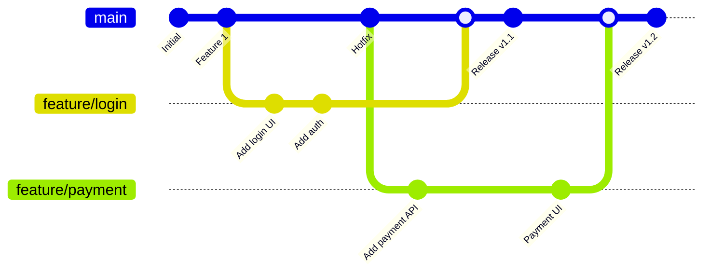

A branch in version control is a parallel version of the code that allows developers to work on different features or fixes independently without affecting the main codebase. Here's a comprehensive explanation:

1. Branch Concepts
   - A branch is a separate line of development
   - Each branch maintains its own commit history
   - Branches can be merged back together
   - The main branch (often called 'main' or 'master') represents the stable version

2. Common Branch Types
   - Main/Master Branch: Primary stable codebase
   - Feature Branches: For new features
   - Release Branches: For preparing releases
   - Hotfix Branches: For emergency fixes
   - Development Branch: Integration branch for features

3. Common Branching Strategies

   a. Feature Branching
   ```
   - Create branch from main
   - Develop feature
   - Test changes
   - Merge back to main
   ```

   b. GitFlow
   ```
   - main (stable)
   - develop (integration)
   - feature/* (new features)
   - release/* (release prep)
   - hotfix/* (emergency fixes)
   ```

   c. Trunk-Based Development
   ```
   - Short-lived feature branches
   - Frequent merges to main
   - Emphasis on small changes
   ```

4. Branch Operations
   - Create: Make new branch
   - Checkout: Switch to branch
   - Merge: Combine branches
   - Delete: Remove completed branch
   - Push/Pull: Share branches

5. Best Practices
   - Keep branches focused and single-purpose
   - Regularly sync with parent branch
   - Delete branches after merging
   - Use clear naming conventions
   - Review before merging

6. Branch Naming Conventions
   ```
   feature/login-system
   bugfix/password-reset
   hotfix/security-patch
   release/v1.2.0
   ```

7. Branching Workflows

   a. Feature Development
   ```
   1. Create feature branch
   2. Make changes
   3. Test changes
   4. Create pull request
   5. Code review
   6. Merge to main
   ```

   b. Hotfix Process
   ```
   1. Branch from main
   2. Fix issue
   3. Test fix
   4. Merge to main
   5. Tag release
   ```

8. Common Challenges
   - Merge conflicts
   - Long-lived branches
   - Branch organization
   - Integration issues
   - Branch dependency

9. Tools and Commands
   ```bash
   # Git commands
   git branch feature-name         # Create branch
   git checkout branch-name        # Switch branch
   git merge branch-name          # Merge branch
   git branch -d branch-name      # Delete branch
   git push origin branch-name    # Share branch
   ```

10. Advanced Concepts
    - Branch Protection Rules
    - Code Review Requirements
    - Automated Testing
    - Continuous Integration
    - Branch Policies

Would you like me to elaborate on any specific aspect of branching, such as merge strategies or specific workflows?
</blockquote>
</details>

**My Take:**


### AI Model

**prompt 1: Explain branch and branching in Version control systems.

<details>
    <summary>
        answer
    </summary>
    <br>
<blockquote>
</blockquote>
</details>

**My Take:**


### AI Model

**prompt 1: Explain branch and branching in Version control systems.

<details>
    <summary>
        answer
    </summary>
    <br>
<blockquote>
</blockquote>
</details>

**My Take:**


### AI Model

**prompt 1: Explain branch and branching in Version control systems.

<details>
    <summary>
        answer
    </summary>
    <br>
<blockquote>
</blockquote>
</details>

**My Take:**


### AI Model

**prompt 1: Explain branch and branching in Version control systems.

<details>
    <summary>
        answer
    </summary>
    <br>
<blockquote>
</blockquote>
</details>

**My Take:**


### AI Model

**prompt 1: Explain branch and branching in Version control systems.

<details>
    <summary>
        answer
    </summary>
    <br>
<blockquote>
</blockquote>
</details>

**My Take:**


### AI Model

**prompt 1: Explain branch and branching in Version control systems.

<details>
    <summary>
        answer
    </summary>
    <br>
<blockquote>
</blockquote>
</details>

**My Take:**


### AI Model

**prompt 1: Explain branch and branching in Version control systems.

<details>
    <summary>
        answer
    </summary>
    <br>
<blockquote>
</blockquote>
</details>

**My Take:**


### AI Model

**prompt 1: Explain branch and branching in Version control systems.

<details>
    <summary>
        answer
    </summary>
    <br>
<blockquote>
</blockquote>
</details>

**My Take:**


### AI Model

**prompt 1: Explain branch and branching in Version control systems.

<details>
    <summary>
        answer
    </summary>
    <br>
<blockquote>
</blockquote>
</details>

**My Take:**


### AI Model

**prompt 1: Explain branch and branching in Version control systems.

<details>
    <summary>
        answer
    </summary>
    <br>
<blockquote>
</blockquote>
</details>

**My Take:**


### AI Model

**prompt 1: Explain branch and branching in Version control systems.

<details>
    <summary>
        answer
    </summary>
    <br>
<blockquote>
</blockquote>
</details>

**My Take:**
