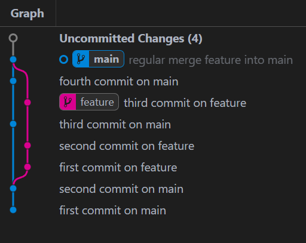
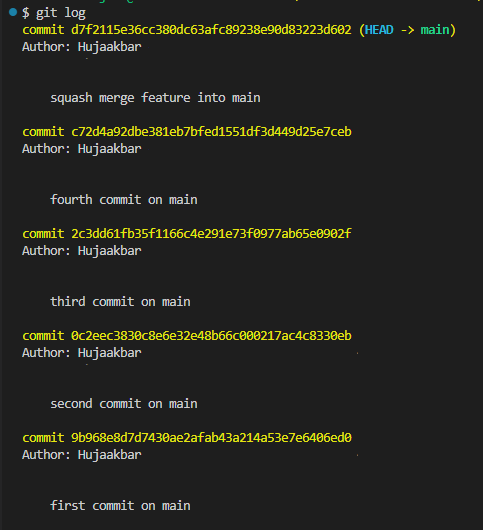

# Git Squash Merge

There are many good answers that teach git commands to squash merge.
I will try to explain what happens in squash merge when those commands are executed.

Lets use below example:  
In the repository with default `main` branch, after two commits, a new `feature` branch is created.
Some work happened in `feature` branch. `feature` branch now has 2 commits that it shares with `main` branch, and 3 exclusive commits (exists only in `feature` branch).  
In the meantime, others worked on `main` branch and added 2 new commits  (exists only in `main` branch).


`git log` output of the `main` branch:

```bash
c72d4a9 (HEAD -> main) fourth commit on main
2c3dd61 third commit on main
0c2eec3 second commit on main
9b968e8 first commit on main
```

`git log` output of the `feature` branch:

```bash
786650f (HEAD -> feature) third commit on feature
21cbaf1 second commit on feature
677bc7f first commit on feature
0c2eec3 second commit on main
9b968e8 first commit on main
```

We want to merge the changes that exist on the `feature` branch into the `main` branch.
First let's review *regular* merge then  `squash` merge

## Regular merge

```bash
# switch to main branch
git switch main

# merge two branches (commits on the top of these two branches)
git merge feature

```

If there are conflicting changes, merge conflict will arise.

Merge conflict example:

```shell
git merge feature
Auto-merging main.txt
CONFLICT (content): Merge conflict in main.txt
Automatic merge failed; fix conflicts and then commit the result.
```

We should resolve the merge conflict, stage the resolved state and commit.

```shell
git add 

git commit -m <commit message>
```

If there are no conflicts, `git merge` command opens the editor and asks us to enter the commit message. After we close the editor, it is committed.

```bash
git merge feature
Merge made by the 'ort' strategy.
```

We can provide commit message while executing `git merge` command.

```bash
git merge feature -m 'merge feature into main'
Merge made by the 'ort' strategy.
```

**Result:**

It merges two branches. We can see it on the below graph.



`merge commit` has two parent commits:

```bash
Commit: a76ce17e8e36915d50edda2c42406e52cbdc876f
Parents: c72d4a92dbe381eb7bfed1551df3d449d25e7ceb, 786650f08684a2779d0e5c96cec54bdc59f10325
Author: Hujaakbar <username@xxx.com>
Committer: Hujaakbar <username@xxx.com>
Date: Thu Sat 23 2024 

regular merge feature into main
```

`git log` history includes commits of both `main` and `feature` branches.

```bash
git log --oneline
a76ce17 (HEAD -> main) regular merge feature into main
c72d4a9 fourth commit on main
786650f (feature) third commit on feature
2c3dd61 third commit on main
21cbaf1 second commit on feature
677bc7f first commit on feature
0c2eec3 second commit on main
9b968e8 first commit on main
```

Commit history of the main branch changed. Now between `0c2eec3 second commit on main` and `2c3dd61 third commit on main` commits (of the main branch), `21cbaf1 second commit on feature` and `677bc7f first commit on feature` commits (of feature branch) are inserted.

There is nothing wrong with regular merge. But some people find it confusing or unnecessary to include all the commits from feature branch. Especially multiple branches are merged into main branch on a regular bases. They prefer other ways such as squash merge or rebase.

## Squash merge

```bash
# switch to main branch
git switch main

# squash all the changes of the feature branch and merge them into main branch
git merge --squash feature

```

When you run above commands, if conflict arises, we should resolve it and
run `git add` command.  

Conflict example:

```shell
git merge --squash feature
Auto-merging main.txt
CONFLICT (content): Merge conflict in main.txt
Squash commit -- not updating HEAD
Automatic merge failed; fix conflicts and then commit the result.
```

If there is no conflict, git automatically combines the changes and stages them. But git does **not make a commit**, even if we provide commit message.

Git squash merge example with no conflict

```bash
git merge --squash feature
Squash commit -- not updating HEAD
Automatic merge went well; stopped before committing as requested
```

### What does squash merge do differently?

`squash merge` operation takes all the changes made on the `feature` branch, and puts them onto the `main` branch. **It does not merge commits**. *We can think like we never had a `feature` branch, rather we continuously worked on `main` branch and made lots of changes without committing.*
After we run the squash merge command, we should save the combination of the changes by committing.  

```shell
git commit -m <commit message>
```

The resulting commit will have a single parent. It won't have any reference to `feature` branch.

Resulting commit:

```bash
Commit: d7f2115e36cc380dc63afc89238e90d83223d602
Parents: c72d4a92dbe381eb7bfed1551df3d449d25e7ceb
Author: Hujaakbar <username@xxx.com>
Committer: Hujaakbar <username@xxx.com>
Date: Thu Sat 23 2024
 

squash merge feature into main
```

The result looks like this:


As we can see on the above graph, two branches are not merging.

Important points to notice:

- `feature` branch is untouched (it is not changed in any way).
- git adds the changes to the stage but do not commit them, we should commit
- resulting commit has single parent commit and it has no reference to `feature` branch.
- `git log` command run on the `main` branch shows  only  commits made in the `main` branch. (clean looking linear history)

```bash
git log --oneline
d7f2115 (HEAD -> main) squash merge feature into main
c72d4a9 fourth commit on main
2c3dd61 third commit on main
0c2eec3 second commit on main
9b968e8 first commit on main
```


