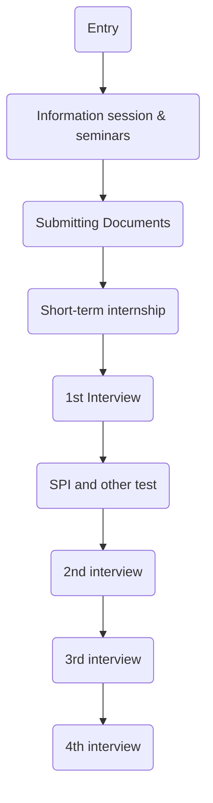

# Job Hunting In Japan

Every year japanese companies hire new graduates en masse. The selection process starts while the perspective applicants are still at university. Well before graduating the university, virtually all of them should finish the job hunting.

> **Setting up the scenario:**
Imagine you are a third year university student planning to work in  Japan after graduation. Hereafter by "you", I mean a university student.

## Job Hunting Preparation

You should begin preparing for the job hunting starting your third year at the university. Yes, it might seem early, but it is not. Soon you will find out why.

Job hunting preparation should include among others, getting a Japanese language proficiency certificate, English language proficiency certificate, and brushing up your math skills. The preparation usually takes about five months.

You can demonstrate your proficiency in Japanese by getting a JLPT, [Japanese Language Proficiency Test](https://www.jlpt.jp/e/), it is the most popular Japanese language test. Try to get JLPT N1 or N2 certificates. As for English, [TOEIC](https://www.etsglobal.org/fr/en) is a popular option in Japan.

> Note:
> JLPT exams take place only twice a year: in July and December.

If you can get an internship, it will be another huge plus point in your job application. Do as many internships as you can. In addition to internships, you should also join clubs and volunteering activities.

You may also want to inquire what kind of assistance your university provides to students during job-hunting. University staff will walk you through all the details. Oftentimes they might be able to help you with mock interviews as well. Or they might tell you the university exclusive deals. Some universities have agreements with companies to accept job applications from their students before they start to accept job applications from other university students.

> Most universities have a dedicated staff to assist students with job hunting. Instead of relying solely on AI chatbots, you can go to them and ask for assistance.

## Job Hunting

Starting March companies officially begin accepting job applications from third year university students. But a few companies start accepting applications as early as January. Entire recruitment process lasts around four months.

You should start applying for companies when you are towards the end of your 3rd year or early 4th year. Usually the hiring processes have titles like 20xx年度新卒採用 (20xx new graduate recruitment). It means the hiring process is open for students who will graduate in year 20xx.

> Note: in Japan academic and financial year starts in April.

Since companies start to accept applications around the same time and only for a limited period of time, you should apply to multiple companies simultaneously and be really good at time management.

Almost every company website has a "採用情報" (hiring details) page where you can find "新卒採用" (new graduate recruitment) and "キャリア採用" mid-career recruitment tabs. You can apply through companies' websites, however, visiting each companies homepage is tedious. Instead you can use job hunting websites.

Two of the biggest jub hunting websites in Japan are [mynavi](https://job.mynavi.jp/) and [rikunabi](https://job.rikunabi.com/2026/). In these websites, you can find the overview of the company's history, company's business, open positions, salary and other perks.

**Choosing companies:**

You should choose the company whose values and mission aligns with yours. Naturally, you may well be aware of this. I am not going to teach you that. What I am going to tell you is some of the most overlooked points. For example if your company selection criteria includes salary, and working environment make sure to check and confirm below points.

- Majority of the Japanese companies give cash bonuses twice a year. For that reason, it is always better to check annual salary rather than monthly salary.

- Death from overwork is a real thing. Ask the company representatives about the work culture including overworking. Check third-party review websites such as [OpenWork](https://www.openwork.com/) and [Glassdoor](https://www.glassdoor.com/index.htm) for the company's working environment.

- Some companies, especially ones who never hired a foreigner before might struggle to air your visa application process. Ask the company if they can help you with obtaining visa.

### Application process

Application process goes more or less like below.

Entry is submitting short online form by registering your name, email address, university name etc. It is way of letting the company know that you are interested in applying to this company. After you make entry, company will send you an email introducing you to their hiring process and asking you to take certain steps like below.

#### Information session (説明会) and Seminars

Companies host information sessions and seminars explaining their business, culture and philosophy. Oftentimes participating in the information sessions is one of the requirements for the job application. If you don't participate, some companies may not proceed with your application.

#### Submitting Application

You should submit entry sheet and/or your resume to each company. Entry sheet questions and format are provided by each company. Resume format is provided by your university. You will also asked to submit your transcript (university grades).

##### Entry Sheet

Companies usually ask you to answer certain questions in a written format called Entry Sheet. Entry sheet is divided into two parts. In the first part, you need to fill in the basic information like your name, address, email address, home address, university name, your major etc. The second part usually includes two to five open-ended questions.

Sample entry sheet open-ended questions:

- why did you choose our company
- why have you chosen this career path
- what do you want to achieve in 5 years period
- what is the biggest challenge you ever faced
- what is your weakness
- what do yo want to improve in yourself

##### Your resume should include below sections

1. Your basic information:
    - name
    - birthdate
    - address
    - email address
    - phone number
1. Educational background: the name of schools you attended and dates
    1. when you graduated high school
    1. when you entered the university
    1. when you are expected to graduate from university
1. Self-introduction
    1. reason for application: why you are applying for this position and this company (about 300~350 japanese characters)
    1. your favorite subject, research project or graduation thesis (about 300~350 japanese characters)
    1. what you focused on as a student and what you learnt from it (about 300~350 japanese characters)
    1. hobbies and interests (about 150 japanese characters)
    1. Your strengths (about 300~350 japanese characters)
    1. Other achievements (about 250 japanese characters)
1. Certificates, Internships, and Licenses

As you can see entry sheet and resume overlaps quite a bit, so that some companies require only one of them, while others require both.

> **IMPORTANT NOTE**
> Although companies ask your major at the university, most of them do not really care about it (with certain exceptions such as a medical company). Even if you are majoring in hospitality or liberal arts, you can still apply to totally unrelated positions like sales, accounting, and programming.
> We will explore this topic more broadly later in this post.

#### Internship

There are two types of internships: long-term internships that last weeks or months and short-term internships that last couple of hours. Long-term internships are paid, while short-term ones are most likely not.

Some of the companies that you are applying to might offer you to join their short-term internship program. During internships applicants are told to carry out easy group projects. HR staff closely monitors each applicant to determine how well they perform as a team member.

Use short-term internships to showcase how well you can communicate and work with others. Keeping a harmony and being a team-player is a huge deal in Japan.

You participated in the short-term internship, but down the road your application is rejected. Don't think you wasted your time, you can still salvage it. When companies ask you whether you have internship experience they usually mean long-term internships. But if you don't have any long-term internship experience under your belt, you can list your short-term internship experience. Moral of the story: even if it is small, something is always better than nothing.

#### First Interview

If your application was successful, you will be invited to the first interview. The first interview will be conducted by HR personnel. Typical questions you will be asked are why you applied to that particular company etc.

Oftentimes they also ask you whether you have gotten job offers from other companies. If you have, you should tell the interviewer about them. It will increase your odds by great margin.

#### SPI and other test

After the first interview, you will be asked to take SPI test. SPI test stands for Synthetic Personality Inventory test. It has two main sections:

- the first section assesses your general skills like Japanese language, (sometimes English as well), logical and pattern-based reasoning, and **high school level math**
- the second section evaluates personality.

Note: All the questions will be in Japanese.

#### Further interviews

Depending on the company, there might be in total three or four interviews.

Three interview case:

1. First interview with HR personnel
1. Second interview with middle managers and higher level HR manager
1. Third interview with top managers and possibly CEO

Four interview case:

1. First interview with HR personnel
1. Second interview with regular employees who might be your future colleagues
1. Third interview with middle managers and higher level HR manager
1. Fourth interview with top managers and possibly CEO

Common questions:

- why do you want to join our company
- tell us your weakness and strengths
- do you have any team effort experience
- where do you see yourself in 5 years
- have you received job offers from other companies
- have you are going to choose which company to work for

> Usually companies cover transportation expenses of candidates. If candidate has to stay overnight, hotel expenses will be covered too.

### Selection criteria

**When hiring new graduates, japanese companies seek for smart candidates, not necessarily experts in the given field.** Companies want to get the brightest candidates and nurture them. What it means is your major and university don't play any important role. You don't even need to know anything about *the field* you will be assigned to. In short, regardless of your expertise, major or university, you can apply to almost all jobs.

Japanese companies want a candidate who:

- has critical thinking
- has good communication skills
- is a team player
- keeps the harmony
- learns and adapts quickly

Being the team player is a very important criterion. In every step of the application process you will be asked about your team effort. That's also why during recruitment process companies arrange internships to see how you act within a team. The best way to become a good team player is by joining to university activities, clubs, and volunteering activities.

## Job offer (内定)

After you pass all the screening that last for four months, you will be notified with 内定 (naitei). It is early (unofficial) job offer. Usually you will be given one month to decide whether to accept it or not. After you accept it, around September or October you will be sent official job offer.

After accepting the job offer, later on you will be asked to submit your health check-up and other documents. Since there are usually five to six months until you start to work, from time to time companies arrange events or meetings. Some of them might offer you a paid internship opportunity too.

## Salary and Perks

Companies offer the same salaries to new graduate hires with the same qualifications (master's degree holders will get around 10% higher salary). Companies also cover commuting (bus and subway) transportation fees.

> Note: most companies have annual salary increases in April.

**Special perks:**
Some companies offer lunch allowances or serve free lunches. While others might offer rent subsidies up to 3 years.

As a new graduate hire, You cannot negotiate the salary or perks. You can choose whether to accept/utilize available perks, but you cannot ask the company to make you a tailored offer.

## After joining the company

After you join the company, you will be considered a first-year employee. You will have seniors like second-year employee, third-year employee etc., just like university or school.

### On-the-job Training

Japanese companies hire bright new graduate candidates and teach them the necessary skills during on-the-job training. To be more precise, after you get hired, you will go through three months of training from morning till evening. You will not be working (contributing to company's bottom line), you will be only learning.

You will be taught both technical skills specific to the company's business and Japanese business etiquettes such as how to write business emails, how to greet, how to give presentations etc. So no need to sweat about not possessing knowledge specific to the domain the company operates in. Even after the training period you will be taught how to deliver what is expected from you.

### Job Assignment

One puzzling thing about Japanese companies is that they, companies, decide which department you will belong to and you will have almost no say on it. Until you finish the training, you will have no idea what department you will be assigned to. Based on results of personality test you took during the application process, and how you presented yourself during interviews or even randomly, you might be assigned to sales, accounting, marketing or some other department.

Good news is some companies are finally listening to the growing dissatisfaction of young people with this practice and taking actions to improve it. You might get lucky and get hired by one of these companies who will assign you to the department based on your wishes.
