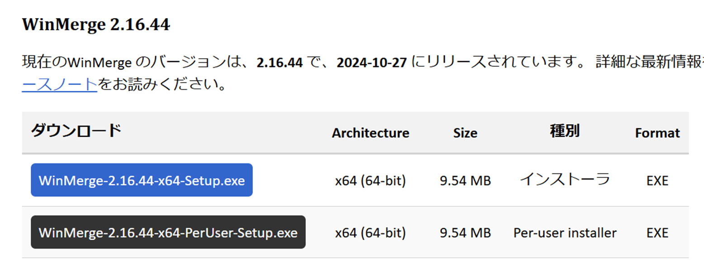
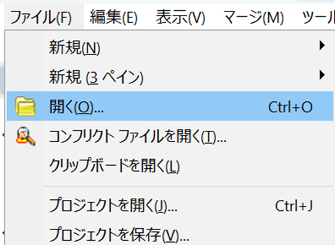

# WinMergeのセットアップ

WinMerge は、Windows 用のオープン ソースの差分およびマージ ツールです。WinMerge は、フォルダーとファイルの両方を比較し、違いを理解して扱いやすい視覚的なテキスト形式で表示します。

source: [https://winmerge.org](https://winmerge.org)

## WinMergeをダウンロード

[WinMergeのウェブサイト](https://winmerge.org/downloads/?lang=ja)に行って、「WinMerge-2.16.44-x64-Setup.exe」ボタンを押し、WinMerge 2.16をダウンロードしてください。

## WinMergeをインストール

ダウンロードされたソフトウェアをクリックし、ポップアップ画面で「Next」を押してください

「Languages」部分をスクロールダウンし、「Japanese menus and dialogs」を選択し、「Next」ボタンを押してください

ターミナル等からもWinMergeをアクセス出来ようにする為に「Add WinMerge folder to your system path」オプションを選択し、希望によって他のオプション選択してください

「Enable Explorer context menu Integration」オプションを選択したら、フォルダ／ファイルを右キリックし、コンテクストメニューからWinMergeを開くようになります。

「Install」ボタンを押し、「Next」ボタンを押し、その後、「Finish」ボタンを押してください

今WinMergeを使えます。でも、もっと効果的に使う為にちょっとカスタマイズしましょう。

## 言語を日本語にする

もしWinMergeの言語が日本語じゃなくて、英語なら、「Edit」タブから「Options」を押してください。

ポップアップ画面で右側の下にある「Languages」と言うドロップダウンメニューから日本語を選択し、「OK」ボタンを押してください

## WinMergeを使う方

「ファイル」タッブから「開く」を押し

参照ボタンを押し、比較したいフォルダ・ファイルを指定

**比較したいファイルを指定する方法:**

ポップアップ画面から対象のフォルダーを選択し、「Open」を押してくだい

何も選択しないで、「Open」を押してくだい

右側下にある「比較」ボタンを押し

## WinMergeをカスタマイズ

「表示」タッブから「同一項目の表示」を選択解除してください

「ツール」タッブから「列の設定」を選択

「追加プロパティ」を押し

ファイル名とフォルダのパスを右側にして、OKを押し

下に見せられているように11項目を選択し、「OK」を押し

## CSVのレポートを出す

比較の後、「ツール」タッブから「レポートの生成」ボタンを押し

CSVファイルを保存したい場所を指定し、ファイルの形をCSVにして、「OK」ボタンを押してくだい

以上です。この記事読んでくれてありがとうございました。
